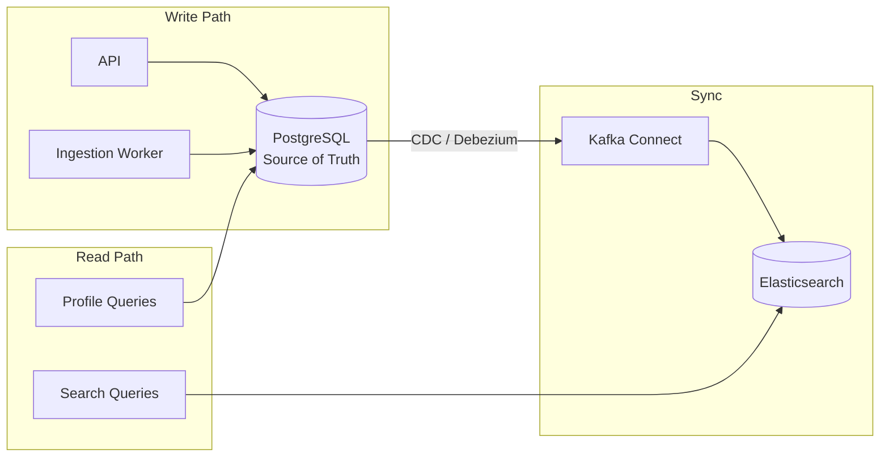

# ADR-002: Search Strategy — PostGIS + pg_trgm for v1, Elasticsearch for v2

**Date:** 2026-02-28  
**Status:** Accepted  
**Author:** Frank Reynolds, DevOps & Solutions Architect

## Context

The platform requires sophisticated search capabilities:

1. **Geospatial:** Find physicians within X miles of a GPS coordinate
2. **Full-text:** Search by physician name, organization name
3. **Faceted filtering:** Filter by specialty, credential, gender, Medicare assignment, telehealth
4. **Aggregate filtering:** Filter by Part B procedure volume, Part D drug prescribing volume, Open Payments total
5. **Sorting:** By distance, name, billing volume, payment total
6. **Performance:** Results in < 3 seconds for radius queries up to 50 miles

These search dimensions span multiple tables (physician, physician_address, physician_taxonomy, physician_cms_profile, partb_service, partd_drug, open_payments_general).

### Options Considered

| Option | Pros | Cons |
|--------|------|------|
| **PostgreSQL only (PostGIS + pg_trgm)** | No additional infrastructure; consistent data; simpler ops | Complex multi-table joins may slow down; limited faceted search support |
| **Elasticsearch only** | Best-in-class search + geo + facets + aggregations | Not a system of record; data sync complexity; eventual consistency; additional infra cost |
| **PostgreSQL primary + Elasticsearch secondary** | Best of both worlds; PG for ACID, ES for search | Data sync pipeline; two systems to maintain; added complexity |
| **Typesense / Meilisearch** | Simpler than ES; good search UX | Less mature geo support; smaller ecosystem |

## Decision

**Phase 1 (MVP):** PostgreSQL with PostGIS + pg_trgm handles all search. No Elasticsearch.

**Phase 2 (if needed):** Add Elasticsearch as a read-only search index if PostgreSQL search performance degrades under production load with complex multi-criteria queries.

### Phase 1 Implementation

```sql
-- Geospatial radius search
SELECT p.npi, p.last_name, p.first_name, 
       ST_Distance(a.geom, ST_MakePoint(:lng, :lat)::geography) AS distance_meters
FROM physician p
JOIN physician_address a ON p.npi = a.npi
JOIN physician_taxonomy t ON p.npi = t.npi
WHERE a.address_purpose = 'LOCATION'
  AND ST_DWithin(a.geom, ST_MakePoint(:lng, :lat)::geography, :radius_meters)
  AND t.taxonomy_desc = :specialty
  AND t.is_primary = TRUE
ORDER BY distance_meters
LIMIT 500;

-- Full-text name search with trigram similarity
SELECT p.npi, p.last_name, p.first_name,
       similarity(p.last_name || ' ' || p.first_name, :query) AS score
FROM physician p
WHERE (p.last_name || ' ' || p.first_name) % :query
ORDER BY score DESC
LIMIT 50;

-- Aggregate filter: physicians prescribing drug X with >= N claims
SELECT p.npi, p.last_name, p.first_name, SUM(d.total_claims) AS total_claims
FROM physician p
JOIN partd_drug d ON p.npi = d.npi
WHERE d.generic_name ILIKE :drug_name
  AND d.data_year = :year
GROUP BY p.npi, p.last_name, p.first_name
HAVING SUM(d.total_claims) >= :min_claims
ORDER BY total_claims DESC;
```

### Phase 2 Trigger Criteria

Move to Elasticsearch if **any** of these occur:
- Physician search p95 latency > 3 seconds under production load
- Multi-criteria queries (geo + specialty + Part B filter + Part D filter) consistently > 5 seconds
- Users request faceted counts (e.g., "show me how many results per specialty") which are expensive in SQL
- Search query volume exceeds 1,000 queries/second sustained

### Phase 2 Architecture (if triggered)



## Consequences

### Positive
- Phase 1 is simpler: one database, no sync pipeline, no eventual consistency issues
- PostGIS geospatial performance is proven at 5M+ records with proper indexing
- pg_trgm handles physician name search well for the fuzzy matching use case
- Delays Elasticsearch operational complexity until it's actually needed
- Saves ~$300-500/month in infrastructure costs for Phase 1

### Negative
- Complex multi-table joins (geo + specialty + Part B volume + Part D drug) will need careful query optimization and possibly materialized views
- No faceted search counts without Elasticsearch (acceptable for MVP)
- If Elasticsearch is needed in Phase 2, retrofitting the sync pipeline is non-trivial (~2-3 weeks engineering)

### Mitigations
- Create materialized views for common search patterns (e.g., physician summary with top specialties, total billing, total payments)
- Refresh materialized views on data ingestion schedule (not real-time)
- Index aggressively on filter columns
- Use Redis caching for repeated search patterns (15-min TTL)

## Follow-Up
- Benchmark search queries against production-scale data (5M physicians, 250M Part B rows) during development
- Set up CloudWatch custom metrics for search latency (p50, p95, p99)
- Document the Phase 2 Elasticsearch migration plan so it's ready when needed
