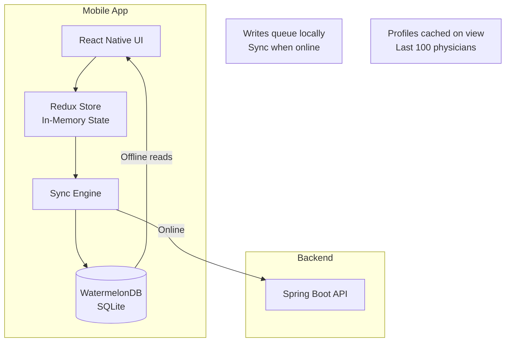

# ADR-003: React Native for Cross-Platform Mobile Development

**Date:** 2026-02-28  
**Status:** Accepted  
**Author:** Frank Reynolds, DevOps & Solutions Architect

## Context

The platform requires a mobile-first application for iOS and Android with the following requirements:

1. **GPS location access** for nearby physician search and map display
2. **Push notifications** for task reminders
3. **Offline mode** — view cached profiles and log calls without connectivity
4. **Map rendering** with color-coded pins (up to 500 visible)
5. **App Store / Play Store** distribution
6. **Performance:** 2-second profile loads on 4G, 2-second map rendering for 500 pins

The web companion app (for managers/admins) is a separate React SPA — not part of this decision.

### Options Considered

| Option | Pros | Cons |
|--------|------|------|
| **Native (Swift + Kotlin)** | Best performance; full platform API access; best UX polish | Two codebases; 2x engineering effort; harder to keep in sync |
| **React Native** | Single codebase; 90%+ code sharing; large ecosystem; native modules when needed; strong community | Bridge overhead on heavy computation; occasional native module compatibility issues; debugging can be harder |
| **Flutter** | Single codebase; excellent performance (Dart compiles to native); great UI toolkit | Smaller ecosystem than RN; Dart developer pool is smaller; less mature enterprise adoption |
| **Ionic / Capacitor** | Web-based; fastest time-to-market; one codebase | WebView performance limits; map rendering and GPS access less reliable; offline mode harder; App Store review risk |
| **PWA** | No app store; instant updates; one codebase | No push on iOS (limited); poor offline; no GPS background; doesn't feel native; users expect app store presence |

## Decision

**React Native** for cross-platform mobile development (iOS + Android from a single codebase).

Key reasons:

1. **Code sharing:** 90%+ shared code between iOS and Android reduces engineering effort significantly vs. native. For a startup/early-stage product, this is the right trade-off.

2. **Map performance:** React Native Maps (`react-native-maps`) wraps native Apple Maps (iOS) and Google Maps (Android) — this is a native component, not a WebView. 500 pins with clustering is well within its capability.

3. **Offline support:** Libraries like WatermelonDB or SQLite via `react-native-sqlite-storage` provide robust local database support for offline caching and sync queuing.

4. **GPS / Location:** `react-native-geolocation-service` provides full GPS access including background location (if needed later for route tracking).

5. **Push notifications:** Firebase Cloud Messaging integration via `@react-native-firebase/messaging` is mature and well-documented.

6. **Developer availability:** React Native developers are more available and less expensive than native iOS+Android specialists. The web team (React SPA) shares significant knowledge with the mobile team.

7. **Performance:** React Native's new architecture (Fabric renderer, JSI, Hermes engine) provides near-native performance for the UI patterns in this app (lists, profiles, maps, forms).

### Technology Stack

| Concern | Library |
|---------|---------|
| Framework | React Native 0.75+ (New Architecture) |
| JS Engine | Hermes (default) |
| Navigation | React Navigation 7.x |
| State Management | Redux Toolkit + RTK Query |
| Maps | react-native-maps |
| GPS | react-native-geolocation-service |
| Offline DB | WatermelonDB (SQLite-backed) |
| Push | @react-native-firebase/messaging |
| Networking | Axios + RTK Query |
| Forms | React Hook Form |
| UI Components | React Native Paper or custom |
| Testing | Jest + React Native Testing Library + Detox (E2E) |
| CI/CD | Fastlane + GitHub Actions |
| OTA Updates | CodePush (Microsoft) or EAS Update (Expo) |

### Offline Architecture

**Offline capabilities (NFR-026):**
- View last 100 accessed physician profiles (cached in WatermelonDB)
- Log call notes (queued in local DB, synced on reconnect)
- View today's task list (cached)
- Conflict resolution: last-write-wins with server timestamp; conflicts flagged for user review

## Consequences

### Positive
- Single codebase for iOS + Android — faster feature development
- Shared React knowledge with web team
- Native map rendering (not WebView) — good performance for pin display
- Mature ecosystem for all platform requirements (GPS, push, offline, maps)
- OTA update capability (CodePush) — deploy bug fixes without App Store review
- Cost-effective: ~1.5x one native team vs. 2x for dual native

### Negative
- Performance ceiling is lower than pure native for computationally intensive tasks — not a concern for this app's use cases (data display, forms, maps)
- Native module debugging requires platform-specific knowledge (Xcode, Android Studio)
- React Native upgrades can be painful (improved with New Architecture but still a consideration)
- Some edge cases in map clustering with 500+ pins may need native optimization

### Risks
- **App Store rejection:** React Native apps are accepted by both stores; CodePush is allowed as long as app functionality doesn't fundamentally change via OTA
- **Performance on older devices:** Target iOS 16+ and Android 12+ (2021+ devices) mitigates most performance concerns
- **Map rendering lag:** If 500 pins cause jank, implement map clustering (react-native-map-clustering) to reduce rendered elements

## Follow-Up
- Set up React Native project with New Architecture enabled from start
- Benchmark map rendering with 500 pins on target minimum devices (iPhone 12, mid-range Android)
- Implement WatermelonDB schema matching the offline data requirements
- Set up Fastlane for automated App Store and Play Store submissions
- Configure CodePush for OTA update delivery
