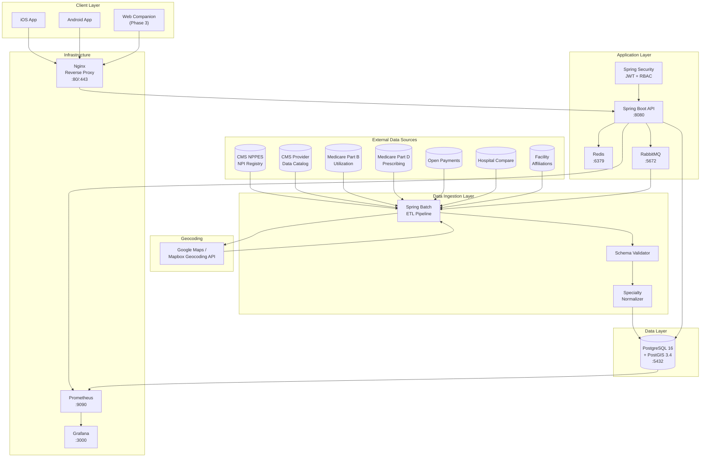
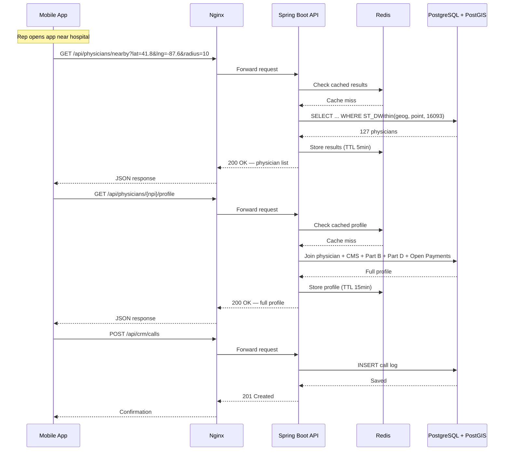
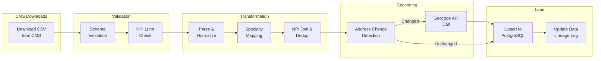

# MedSales — Component Diagram

**Author:** Frank Reynolds, DevOps & Solutions Architect
**Date:** 2026-02-28

---

## System Component Diagram

---

## Service Interaction Diagram

---

## Data Ingestion Flow

---

*Diagrams render in GitHub, GitLab, and any Mermaid-compatible viewer.*
