# Component Diagram
## Medical Sales Intelligence & CRM Platform

**Author:** Frank Reynolds, DevOps & Solutions Architect  
**Date:** February 28, 2026  
**Version:** 1.0

---

## 1. Application Component Architecture

---

## 2. Domain Service Breakdown

### 2.1 Physician Service

Owns the physician master record and all associated data aggregation.

| Method | Endpoint | Description |
|--------|----------|-------------|
| GET | `/physicians/{npi}` | Full physician profile with all data sections |
| GET | `/physicians/{npi}/partb` | Part B utilization details |
| GET | `/physicians/{npi}/partd` | Part D prescribing details |
| GET | `/physicians/{npi}/payments` | Open Payments detail |
| GET | `/physicians/{npi}/affiliations` | Hospital affiliations |
| GET | `/physicians/{npi}/locations` | All practice locations |
| POST | `/physicians/{npi}/flag` | Bookmark / flag physician |

### 2.2 Search Service

Handles all search and filtering operations including geospatial queries.

| Method | Endpoint | Description |
|--------|----------|-------------|
| POST | `/search/physicians` | Multi-criteria physician search |
| GET | `/search/nearby` | Radius search from GPS coordinates |
| POST | `/search/segments` | Save a named search filter |
| GET | `/search/segments` | List saved search segments |
| GET | `/search/export` | Export search results to CSV |

### 2.3 CRM Service

All CRM operations — calls, tasks, opportunities, orders, samples.

| Method | Endpoint | Description |
|--------|----------|-------------|
| POST | `/crm/calls` | Log a call/visit |
| GET | `/crm/calls?npi={npi}` | Call history for physician |
| POST | `/crm/tasks` | Create follow-up task |
| GET | `/crm/tasks?due=today` | Get tasks due today |
| PATCH | `/crm/tasks/{id}` | Update / complete task |
| POST | `/crm/opportunities` | Create opportunity |
| GET | `/crm/pipeline` | Pipeline view (kanban data) |
| POST | `/crm/orders` | Log an order |
| POST | `/crm/samples` | Log sample distribution |
| GET | `/crm/samples/budget` | Sample accountability report |

### 2.4 Route Export Service

Generates AI planning prompts and map deep-link URLs. No external API calls required.

| Method | Endpoint | Description |
|--------|----------|-------------|
| POST | `/routes/export` | Generate AI prompt + map URLs for selected stops |
| POST | `/routes/reorder` | Reorder stops with distance calculations |

### 2.5 Territory Service

Territory definitions and assignment management.

| Method | Endpoint | Description |
|--------|----------|-------------|
| POST | `/territories` | Create territory |
| GET | `/territories/{id}/coverage` | Territory coverage report |
| POST | `/territories/{id}/assign` | Assign rep to territory |
| POST | `/territories/{id}/targets` | Set target physician list |

### 2.6 Dashboard Service

Aggregated metrics for rep and manager dashboards.

| Method | Endpoint | Description |
|--------|----------|-------------|
| GET | `/dashboard/rep` | Rep activity dashboard |
| GET | `/dashboard/manager` | Manager team roll-up |
| GET | `/dashboard/territory` | Territory coverage metrics |

---

## 3. Data Ingestion Pipeline Components

```mermaid
graph TD
    subgraph "Ingestion Pipeline (Spring Batch)"
        SCHED[Cron Scheduler<br>Triggers by dataset schedule]
        DL[File Downloader<br>HTTP/SFTP to S3]
        VAL[Schema Validator<br>Detect format changes]
        PARSE[CSV Parser<br>Stream processing]
        NORM[Specialty Normalizer<br>NUCC → Standard]
        DEDUP[NPI Deduplicator<br>Luhn validation]
        LOAD[Batch Loader<br>COPY / upsert]
        GEO[Geocoding Worker<br>Address → lat/lng]
        META[Metadata Logger<br>Data lineage tracking]
    end

    SCHED --> DL --> VAL
    VAL -->|Schema OK| PARSE
    VAL -->|Schema Changed| ALERT[🚨 Alert Ops Team]
    PARSE --> NORM --> DEDUP --> LOAD --> GEO --> META
```

| Component | Responsibility | Key Detail |
|-----------|---------------|------------|
| File Downloader | Fetches CSV from CMS | Handles ~10 GB files; streams to S3 |
| Schema Validator | Checks column names/types | Catches CMS format changes before loading |
| CSV Parser | Stream-parses large files | Chunk processing, memory-efficient |
| Specialty Normalizer | Maps NUCC ↔ CMS ↔ Open Payments specialties | Uses mapping table (RISK-005) |
| NPI Deduplicator | Validates NPI format (Luhn), deduplicates | Quarantines invalid NPIs (NFR-031) |
| Batch Loader | Upserts to PostgreSQL | Uses COPY for bulk, upsert for incremental |
| Geocoding Worker | Geocodes new/changed addresses | Rate-limited; Google Maps or Mapbox |
| Metadata Logger | Records data lineage | Which file, when loaded, row counts |

---

## 4. Cross-Cutting Concerns

### 4.1 Authentication & Authorization Flow

### 4.2 Offline Sync (Mobile)

```mermaid
sequenceDiagram
    participant App as Mobile App
    participant SQLite as Local SQLite
    participant API as Backend API

    Note over App: Rep goes into a building — no signal
    App->>SQLite: Read cached physician profiles
    App->>SQLite: Write call log entry (queued)
    App->>SQLite: Write task update (queued)
    
    Note over App: Signal restored
    App->>API: POST /sync (queued changes)
    API-->>App: 200 OK (conflicts resolved)
    App->>API: GET /sync/pull (updated data)
    API-->>App: Delta updates since last sync
    App->>SQLite: Apply server updates
```

---

## 5. API Versioning Strategy

- **URL-based versioning:** `/api/v1/...`, `/api/v2/...`
- **Breaking changes** → new version
- **Additive changes** (new fields, new endpoints) → same version
- **Deprecation policy:** Old versions supported for 6 months after successor release
- **Mobile app compatibility:** API must support current version and one prior version simultaneously (mobile app stores have update lag)

---

*Every component has one job. If it does more than one job, it's two components pretending to be one. Split it.*
