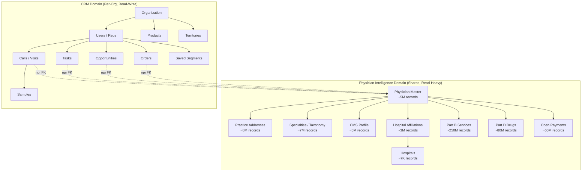
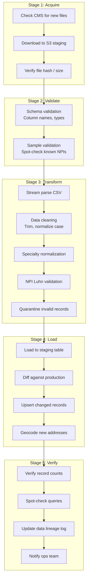
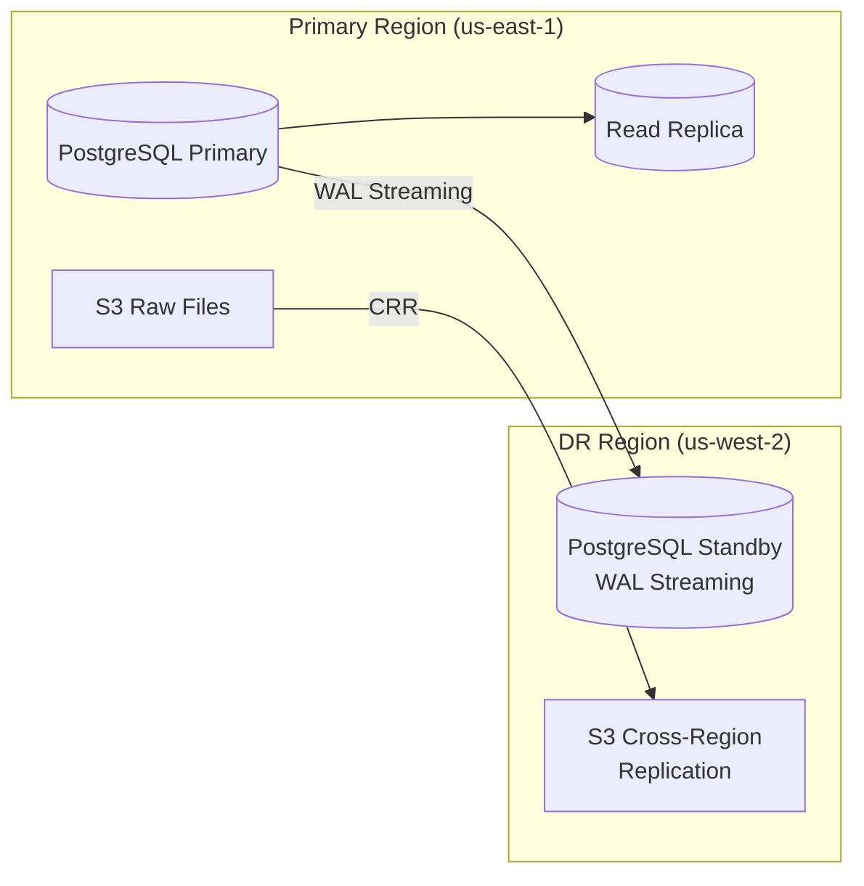

# Data Architecture
## Medical Sales Intelligence & CRM Platform

**Author:** Frank Reynolds, DevOps & Solutions Architect  
**Date:** February 28, 2026  
**Version:** 1.0

---

## 1. Overview

The data architecture separates two fundamentally different data domains:

1. **Physician Intelligence Data** — Public CMS datasets, shared across all tenants, read-heavy, refreshed periodically
2. **CRM Data** — Organization-specific sales activity data, read-write, tenant-isolated, real-time

This separation drives database design, caching strategy, backup policy, and scaling approach.

---

## 2. Data Domain Model



---

## 3. Database Strategy

### 3.1 Primary Database: PostgreSQL 16 + PostGIS 3.4

**Why PostgreSQL:** See [ADR-001](adr/ADR-001-database.md)

Two logical databases on the same cluster (can be physically separated later):

| Database | Purpose | Size Estimate | Access Pattern |
|----------|---------|---------------|----------------|
| `medsales_intelligence` | Physician data from CMS sources | ~500 GB | Read-heavy (95/5 read/write) |
| `medsales_crm` | CRM activity data, multi-tenant | ~50 GB initial, grows | Read-write (60/40) |

### 3.2 Schema Design — Intelligence Database

```sql
-- Core physician record
CREATE TABLE physician (
    npi             VARCHAR(10) PRIMARY KEY,
    last_name       VARCHAR(100) NOT NULL,
    first_name      VARCHAR(100) NOT NULL,
    middle_name     VARCHAR(50),
    credential      VARCHAR(20),
    gender          CHAR(1),
    status          CHAR(1) DEFAULT 'A',  -- A=Active, D=Deactivated
    sole_proprietor CHAR(1),
    enumeration_date DATE,
    last_updated_nppes DATE,
    source_updated_at TIMESTAMP NOT NULL DEFAULT NOW()
);

-- Practice addresses with geospatial index
CREATE TABLE physician_address (
    id              UUID PRIMARY KEY DEFAULT gen_random_uuid(),
    npi             VARCHAR(10) NOT NULL REFERENCES physician(npi),
    address_purpose VARCHAR(10) NOT NULL,  -- LOCATION / MAILING
    address_line_1  VARCHAR(200),
    address_line_2  VARCHAR(200),
    city            VARCHAR(100),
    state           CHAR(2),
    zip5            VARCHAR(5),
    phone           VARCHAR(20),
    fax             VARCHAR(20),
    geom            GEOGRAPHY(POINT, 4326),  -- PostGIS geography
    geo_lat         DECIMAL(9,6),
    geo_lng         DECIMAL(9,6),
    CONSTRAINT uq_physician_address UNIQUE (npi, address_purpose, address_line_1, zip5)
);

CREATE INDEX idx_physician_address_geom ON physician_address USING GIST (geom);
CREATE INDEX idx_physician_address_npi ON physician_address (npi);
CREATE INDEX idx_physician_address_state ON physician_address (state);
CREATE INDEX idx_physician_address_zip ON physician_address (zip5);

-- Specialties (NUCC taxonomy)
CREATE TABLE physician_taxonomy (
    id              UUID PRIMARY KEY DEFAULT gen_random_uuid(),
    npi             VARCHAR(10) NOT NULL REFERENCES physician(npi),
    taxonomy_code   VARCHAR(20) NOT NULL,
    taxonomy_desc   VARCHAR(200),
    is_primary      BOOLEAN DEFAULT FALSE,
    license_number  VARCHAR(50),
    license_state   CHAR(2)
);

CREATE INDEX idx_taxonomy_npi ON physician_taxonomy (npi);
CREATE INDEX idx_taxonomy_code ON physician_taxonomy (taxonomy_code);
CREATE INDEX idx_taxonomy_primary ON physician_taxonomy (npi) WHERE is_primary = TRUE;

-- CMS Provider Data Catalog profile
CREATE TABLE physician_cms_profile (
    npi                 VARCHAR(10) PRIMARY KEY REFERENCES physician(npi),
    ind_pac_id          VARCHAR(20),
    ind_enrl_id         VARCHAR(20),
    group_name          VARCHAR(200),
    org_pac_id          VARCHAR(20),
    num_org_members     INT,
    medical_school      VARCHAR(200),
    grad_year           INT,
    primary_specialty   VARCHAR(200),
    accepts_telehealth  BOOLEAN,
    ind_assignment      CHAR(1),
    grp_assignment      CHAR(1),
    source_updated_at   TIMESTAMP NOT NULL DEFAULT NOW()
);

CREATE INDEX idx_cms_profile_org ON physician_cms_profile (org_pac_id);
CREATE INDEX idx_cms_profile_specialty ON physician_cms_profile (primary_specialty);

-- Hospital affiliations
CREATE TABLE hospital_affiliation (
    id              UUID PRIMARY KEY DEFAULT gen_random_uuid(),
    npi             VARCHAR(10) NOT NULL REFERENCES physician(npi),
    ccn             VARCHAR(6) NOT NULL,
    facility_type   VARCHAR(100),
    source_updated_at TIMESTAMP NOT NULL DEFAULT NOW(),
    CONSTRAINT uq_affiliation UNIQUE (npi, ccn)
);

-- Hospital master record
CREATE TABLE hospital (
    ccn                 VARCHAR(6) PRIMARY KEY,
    name                VARCHAR(200) NOT NULL,
    address             VARCHAR(200),
    city                VARCHAR(100),
    state               CHAR(2),
    zip                 VARCHAR(10),
    phone               VARCHAR(20),
    hospital_type       VARCHAR(100),
    ownership_type      VARCHAR(100),
    emergency_services  BOOLEAN,
    overall_star_rating INT,
    geom                GEOGRAPHY(POINT, 4326),
    geo_lat             DECIMAL(9,6),
    geo_lng             DECIMAL(9,6),
    source_updated_at   TIMESTAMP NOT NULL DEFAULT NOW()
);

-- Part B utilization (partitioned by data_year)
CREATE TABLE partb_service (
    id                      UUID PRIMARY KEY DEFAULT gen_random_uuid(),
    npi                     VARCHAR(10) NOT NULL,
    data_year               INT NOT NULL,
    hcpcs_code              VARCHAR(10) NOT NULL,
    hcpcs_desc              VARCHAR(300),
    total_beneficiaries     INT,
    total_services          INT,
    total_submitted_charges DECIMAL(14,2),
    total_medicare_payment  DECIMAL(14,2),
    avg_medicare_payment    DECIMAL(10,2)
) PARTITION BY LIST (data_year);

CREATE INDEX idx_partb_npi ON partb_service (npi);
CREATE INDEX idx_partb_hcpcs ON partb_service (hcpcs_code);
CREATE INDEX idx_partb_npi_year ON partb_service (npi, data_year);

-- Part D prescribing (partitioned by data_year)
CREATE TABLE partd_drug (
    id                  UUID PRIMARY KEY DEFAULT gen_random_uuid(),
    npi                 VARCHAR(10) NOT NULL,
    data_year           INT NOT NULL,
    brand_name          VARCHAR(200),
    generic_name        VARCHAR(200),
    total_claims        INT,
    total_30day_fills   DECIMAL(10,2),
    total_day_supply    INT,
    total_drug_cost     DECIMAL(14,2),
    total_beneficiaries INT,
    opioid_flag         BOOLEAN DEFAULT FALSE
) PARTITION BY LIST (data_year);

CREATE INDEX idx_partd_npi ON partd_drug (npi);
CREATE INDEX idx_partd_drug ON partd_drug (generic_name);
CREATE INDEX idx_partd_brand ON partd_drug (brand_name);
CREATE INDEX idx_partd_npi_year ON partd_drug (npi, data_year);

-- Open Payments
CREATE TABLE open_payments_general (
    record_id           VARCHAR(50) PRIMARY KEY,
    npi                 VARCHAR(10),
    program_year        INT NOT NULL,
    manufacturer_name   VARCHAR(200),
    manufacturer_id     VARCHAR(50),
    payment_amount      DECIMAL(12,2),
    payment_date        DATE,
    nature_of_payment   VARCHAR(200),
    form_of_payment     VARCHAR(100),
    product_name_1      VARCHAR(200),
    product_type_1      VARCHAR(100),
    product_ndc_1       VARCHAR(20),
    change_type         VARCHAR(50)
);

CREATE INDEX idx_payments_npi ON open_payments_general (npi);
CREATE INDEX idx_payments_year ON open_payments_general (program_year);
CREATE INDEX idx_payments_mfr ON open_payments_general (manufacturer_name);
CREATE INDEX idx_payments_npi_year ON open_payments_general (npi, program_year);

-- Specialty normalization mapping
CREATE TABLE specialty_mapping (
    id                  SERIAL PRIMARY KEY,
    nucc_code           VARCHAR(20),
    nucc_desc           VARCHAR(200),
    cms_specialty       VARCHAR(200),
    open_payments_spec  VARCHAR(200),
    normalized_name     VARCHAR(200) NOT NULL,
    normalized_category VARCHAR(100)
);

CREATE INDEX idx_specialty_nucc ON specialty_mapping (nucc_code);
CREATE INDEX idx_specialty_cms ON specialty_mapping (cms_specialty);

-- Data lineage tracking
CREATE TABLE data_lineage (
    id              SERIAL PRIMARY KEY,
    dataset_name    VARCHAR(100) NOT NULL,
    source_url      TEXT,
    file_name       VARCHAR(200),
    file_size_bytes BIGINT,
    record_count    INT,
    ingested_at     TIMESTAMP NOT NULL DEFAULT NOW(),
    status          VARCHAR(20) NOT NULL,  -- SUCCESS / FAILED / PARTIAL
    error_message   TEXT,
    processing_time_seconds INT
);

-- Full-text search support
CREATE EXTENSION IF NOT EXISTS pg_trgm;

CREATE INDEX idx_physician_name_trgm 
    ON physician USING GIN ((last_name || ' ' || first_name) gin_trgm_ops);
```

### 3.3 Schema Design — CRM Database

```sql
-- Organization (tenant)
CREATE TABLE organization (
    id          UUID PRIMARY KEY DEFAULT gen_random_uuid(),
    name        VARCHAR(200) NOT NULL,
    created_at  TIMESTAMP NOT NULL DEFAULT NOW(),
    settings    JSONB DEFAULT '{}'
);

-- Users within organization
CREATE TABLE crm_user (
    id          UUID PRIMARY KEY DEFAULT gen_random_uuid(),
    org_id      UUID NOT NULL REFERENCES organization(id),
    email       VARCHAR(200) NOT NULL,
    full_name   VARCHAR(200) NOT NULL,
    role        VARCHAR(20) NOT NULL DEFAULT 'rep',  -- rep / manager / admin
    is_active   BOOLEAN DEFAULT TRUE,
    created_at  TIMESTAMP NOT NULL DEFAULT NOW()
);

CREATE UNIQUE INDEX idx_user_email ON crm_user (org_id, email);

-- Product catalog (per-org)
CREATE TABLE product (
    id                  UUID PRIMARY KEY DEFAULT gen_random_uuid(),
    org_id              UUID NOT NULL REFERENCES organization(id),
    name                VARCHAR(200) NOT NULL,
    description         TEXT,
    therapeutic_area    VARCHAR(100),
    hcpcs_codes         VARCHAR[] DEFAULT '{}',
    ndc_codes           VARCHAR[] DEFAULT '{}',
    is_active           BOOLEAN DEFAULT TRUE
);

-- Territory definitions
CREATE TABLE territory (
    id          UUID PRIMARY KEY DEFAULT gen_random_uuid(),
    org_id      UUID NOT NULL REFERENCES organization(id),
    name        VARCHAR(200) NOT NULL,
    boundary    JSONB,  -- GeoJSON polygon or ZIP list
    states      VARCHAR[] DEFAULT '{}',
    zip_codes   VARCHAR[] DEFAULT '{}',
    created_at  TIMESTAMP NOT NULL DEFAULT NOW()
);

-- Territory-to-user assignment
CREATE TABLE territory_assignment (
    id              UUID PRIMARY KEY DEFAULT gen_random_uuid(),
    territory_id    UUID NOT NULL REFERENCES territory(id),
    user_id         UUID NOT NULL REFERENCES crm_user(id),
    assigned_at     TIMESTAMP NOT NULL DEFAULT NOW()
);

-- Target physician list (per rep)
CREATE TABLE target_list (
    id          UUID PRIMARY KEY DEFAULT gen_random_uuid(),
    org_id      UUID NOT NULL REFERENCES organization(id),
    user_id     UUID NOT NULL REFERENCES crm_user(id),
    npi         VARCHAR(10) NOT NULL,
    priority    VARCHAR(20) DEFAULT 'normal',
    added_at    TIMESTAMP NOT NULL DEFAULT NOW(),
    CONSTRAINT uq_target UNIQUE (user_id, npi)
);

-- Call / visit log
CREATE TABLE crm_call (
    id              UUID PRIMARY KEY DEFAULT gen_random_uuid(),
    org_id          UUID NOT NULL REFERENCES organization(id),
    user_id         UUID NOT NULL REFERENCES crm_user(id),
    npi             VARCHAR(10) NOT NULL,
    call_date       TIMESTAMP NOT NULL,
    call_type       VARCHAR(20) NOT NULL,  -- in-person / phone / email / virtual
    outcome         VARCHAR(30),
    duration_minutes INT,
    notes           TEXT,
    product_id      UUID REFERENCES product(id),
    created_at      TIMESTAMP NOT NULL DEFAULT NOW()
);

CREATE INDEX idx_call_org ON crm_call (org_id);
CREATE INDEX idx_call_user ON crm_call (org_id, user_id);
CREATE INDEX idx_call_npi ON crm_call (org_id, npi);
CREATE INDEX idx_call_date ON crm_call (org_id, call_date DESC);

-- Sample distribution
CREATE TABLE crm_sample (
    id              UUID PRIMARY KEY DEFAULT gen_random_uuid(),
    org_id          UUID NOT NULL REFERENCES organization(id),
    call_id         UUID REFERENCES crm_call(id),
    user_id         UUID NOT NULL REFERENCES crm_user(id),
    npi             VARCHAR(10) NOT NULL,
    product_id      UUID NOT NULL REFERENCES product(id),
    quantity        INT NOT NULL,
    lot_number      VARCHAR(50),
    expiration_date DATE,
    distributed_at  TIMESTAMP NOT NULL DEFAULT NOW()
);

-- Tasks
CREATE TABLE crm_task (
    id          UUID PRIMARY KEY DEFAULT gen_random_uuid(),
    org_id      UUID NOT NULL REFERENCES organization(id),
    user_id     UUID NOT NULL REFERENCES crm_user(id),
    npi         VARCHAR(10),
    task_type   VARCHAR(30) NOT NULL,
    due_date    DATE NOT NULL,
    priority    VARCHAR(20) DEFAULT 'normal',
    completed   BOOLEAN DEFAULT FALSE,
    completed_at TIMESTAMP,
    notes       TEXT,
    created_at  TIMESTAMP NOT NULL DEFAULT NOW()
);

CREATE INDEX idx_task_user_due ON crm_task (org_id, user_id, due_date) WHERE completed = FALSE;

-- Opportunities / Pipeline
CREATE TABLE crm_opportunity (
    id                  UUID PRIMARY KEY DEFAULT gen_random_uuid(),
    org_id              UUID NOT NULL REFERENCES organization(id),
    user_id             UUID NOT NULL REFERENCES crm_user(id),
    npi                 VARCHAR(10) NOT NULL,
    product_id          UUID REFERENCES product(id),
    stage               VARCHAR(30) NOT NULL,
    estimated_value     DECIMAL(12,2),
    expected_close_date DATE,
    notes               TEXT,
    created_at          TIMESTAMP NOT NULL DEFAULT NOW(),
    updated_at          TIMESTAMP NOT NULL DEFAULT NOW()
);

CREATE INDEX idx_opp_stage ON crm_opportunity (org_id, stage);

-- Orders
CREATE TABLE crm_order (
    id              UUID PRIMARY KEY DEFAULT gen_random_uuid(),
    org_id          UUID NOT NULL REFERENCES organization(id),
    user_id         UUID NOT NULL REFERENCES crm_user(id),
    npi             VARCHAR(10) NOT NULL,
    product_id      UUID REFERENCES product(id),
    quantity        INT,
    order_value     DECIMAL(12,2),
    order_date      DATE NOT NULL,
    order_reference VARCHAR(100),
    created_at      TIMESTAMP NOT NULL DEFAULT NOW()
);

-- Saved search segments
CREATE TABLE saved_segment (
    id          UUID PRIMARY KEY DEFAULT gen_random_uuid(),
    org_id      UUID NOT NULL REFERENCES organization(id),
    user_id     UUID NOT NULL REFERENCES crm_user(id),
    name        VARCHAR(200) NOT NULL,
    filters     JSONB NOT NULL,
    created_at  TIMESTAMP NOT NULL DEFAULT NOW()
);

-- Audit log
CREATE TABLE audit_log (
    id          BIGSERIAL PRIMARY KEY,
    org_id      UUID NOT NULL,
    user_id     UUID,
    action      VARCHAR(50) NOT NULL,
    entity_type VARCHAR(50),
    entity_id   VARCHAR(50),
    details     JSONB,
    ip_address  INET,
    created_at  TIMESTAMP NOT NULL DEFAULT NOW()
);

CREATE INDEX idx_audit_org ON audit_log (org_id, created_at DESC);

-- Row-level security for tenant isolation
ALTER TABLE crm_call ENABLE ROW LEVEL SECURITY;
ALTER TABLE crm_task ENABLE ROW LEVEL SECURITY;
ALTER TABLE crm_opportunity ENABLE ROW LEVEL SECURITY;
ALTER TABLE crm_order ENABLE ROW LEVEL SECURITY;
ALTER TABLE crm_sample ENABLE ROW LEVEL SECURITY;
```

---

## 4. Data Ingestion Architecture

### 4.1 Ingestion Schedule

| Dataset | Frequency | File Size | Est. Load Time | Window |
|---------|-----------|-----------|-----------------|--------|
| NPPES Full | Monthly | ~8-10 GB | ~3 hours | Saturday 2am ET |
| NPPES Delta | Weekly | ~50-200 MB | ~15 min | Sunday 2am ET |
| Provider Data Catalog | Quarterly | ~500 MB | ~45 min | First Saturday after release |
| Facility Affiliations | Quarterly | ~200 MB | ~20 min | With Provider Data Catalog |
| Hospital Compare | Quarterly | ~5 MB | ~2 min | With Provider Data Catalog |
| Part B Utilization | Annually | ~2-3 GB | ~2 hours | Within 48h of release |
| Part D Prescribing | Annually | ~3 GB | ~2.5 hours | Within 48h of release |
| Open Payments | Annually | ~2 GB | ~1.5 hours | Within 48h of release |

### 4.2 Ingestion Pipeline Design



### 4.3 NPI Deduplication & Conflict Resolution

When multiple sources provide data for the same NPI, conflicts are resolved using this precedence:

| Field Category | Primary Source | Fallback Source | Conflict Rule |
|----------------|---------------|-----------------|---------------|
| Name, Gender, Credential | NPPES | — | NPPES is authoritative |
| Practice Address | NPPES | Provider Data Catalog | Flag if they differ |
| Specialty | NPPES (NUCC code) | Provider Data Catalog | Show both; normalize via mapping |
| Medical School, Grad Year | Provider Data Catalog | — | Only source |
| Hospital Affiliations | Facility Affiliation Data | — | Only source |
| Part B Utilization | Part B Dataset | — | Only source |
| Part D Prescribing | Part D Dataset | — | Only source |
| Industry Payments | Open Payments | — | Only source |

---

## 5. Caching Strategy

### 5.1 Redis Cache Layers

| Cache | Key Pattern | TTL | Purpose |
|-------|-------------|-----|---------|
| Physician Profile | `phy:{npi}` | 1 hour | Full aggregated profile |
| Search Results | `search:{hash}` | 15 min | Recent search result sets |
| Nearby Results | `nearby:{lat}:{lng}:{radius}` | 5 min | Geospatial query results |
| Hospital | `hosp:{ccn}` | 24 hours | Hospital master record |
| Specialty List | `specialties` | 24 hours | Normalized specialty dropdown |
| User Session | `session:{token}` | 30 min | Auth session data |

### 5.2 Cache Invalidation

- **Physician profiles:** Invalidated when data ingestion runs (bulk `DEL phy:*`)
- **Search/nearby:** Short TTL; no explicit invalidation needed
- **Hospital data:** Invalidated on quarterly data refresh
- **User sessions:** Sliding window; invalidated on logout

---

## 6. Data Retention & Backup

| Data | Retention | Backup Frequency | RPO | RTO |
|------|-----------|-------------------|-----|-----|
| Physician Intelligence | Current + 3 years history | Daily snapshot | 24 hours | 4 hours |
| CRM Data | Indefinite (customer data) | Continuous (WAL streaming) | 1 hour | 4 hours |
| Audit Logs | 2 years minimum | Daily | 24 hours | 8 hours |
| Raw CMS Files (S3) | Indefinite (archival) | Cross-region replication | — | — |
| Data Lineage | Indefinite | With CRM backup | 1 hour | 4 hours |

### Backup Architecture



---

## 7. Data Volume Estimates

| Table | Initial Records | Annual Growth | Row Size (avg) | Total Size |
|-------|----------------|---------------|----------------|------------|
| physician | 5M | 200K/yr | 200 bytes | ~1 GB |
| physician_address | 8M | 300K/yr | 300 bytes | ~2.5 GB |
| physician_taxonomy | 7M | 250K/yr | 150 bytes | ~1 GB |
| physician_cms_profile | 5M | 200K/yr | 300 bytes | ~1.5 GB |
| hospital_affiliation | 3M | 100K/yr | 100 bytes | ~300 MB |
| hospital | 7K | 100/yr | 400 bytes | ~3 MB |
| partb_service | 250M | 30M/yr | 100 bytes | ~25 GB |
| partd_drug | 80M | 10M/yr | 120 bytes | ~10 GB |
| open_payments_general | 60M | 10M/yr | 200 bytes | ~12 GB |
| **Indexes (estimated)** | — | — | — | ~100 GB |
| **Total Intelligence DB** | — | — | — | **~150 GB** |
| CRM tables (all) | 0 | varies | varies | **~50 GB @ scale** |

---

## 8. Data Quality Rules

| Rule | Implementation | Action on Failure |
|------|---------------|-------------------|
| NPI format (10 digits, Luhn checksum) | Validation at ingestion | Quarantine record |
| Required fields (NPI, last_name, first_name) | NOT NULL constraints | Reject record |
| State code (2-char, valid US state) | Lookup validation | Flag, still import |
| Address geocode success | Geocoding API response | Flag as un-geocoded; retry next run |
| Specialty code validity | NUCC mapping table | Map to "Unknown" if no match |
| Duplicate NPI in same source file | Dedup; keep last occurrence | Log warning |
| Cross-source address discrepancy | Compare NPPES vs Provider Data Catalog | Display both; flag discrepancy on profile |
| Data year sanity | Check year is within expected range | Alert ops team |

---

*Data is the foundation. If the data's wrong, everything built on top of it is wrong. Get the data right first. Then we talk about features.*
