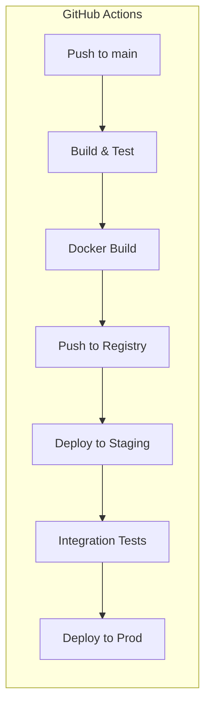
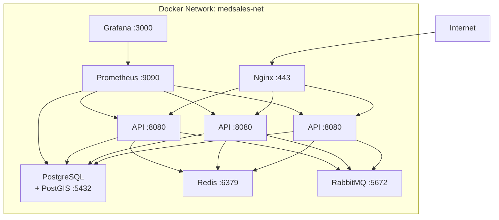

# MedSales — Deployment Architecture

**Author:** Frank Reynolds, DevOps & Solutions Architect
**Date:** 2026-02-28

---

## 1. Docker Compose Service Layout

### 1.1 Development Environment

```yaml
# docker-compose.yml
version: '3.9'

services:
  api:
    build:
      context: .
      dockerfile: Dockerfile
      target: dev
    ports:
      - "8080:8080"
      - "5005:5005"  # Remote debug
    environment:
      - SPRING_PROFILES_ACTIVE=dev
      - SPRING_DATASOURCE_URL=jdbc:postgresql://db:5432/medsales
      - SPRING_DATASOURCE_USERNAME=medsales
      - SPRING_DATASOURCE_PASSWORD=medsales_dev
      - SPRING_REDIS_HOST=redis
      - SPRING_RABBITMQ_HOST=rabbitmq
      - GEOCODING_API_KEY=${GEOCODING_API_KEY}
    volumes:
      - ./src:/app/src
      - ./data/staging:/app/data/staging
    depends_on:
      db:
        condition: service_healthy
      redis:
        condition: service_started
      rabbitmq:
        condition: service_healthy
    networks:
      - medsales-net
    restart: unless-stopped

  db:
    image: postgis/postgis:16-3.4
    ports:
      - "5432:5432"
    environment:
      - POSTGRES_DB=medsales
      - POSTGRES_USER=medsales
      - POSTGRES_PASSWORD=medsales_dev
    volumes:
      - pgdata:/var/lib/postgresql/data
      - ./db/init:/docker-entrypoint-initdb.d
    healthcheck:
      test: ["CMD-SHELL", "pg_isready -U medsales"]
      interval: 10s
      timeout: 5s
      retries: 5
    networks:
      - medsales-net

  redis:
    image: redis:7-alpine
    ports:
      - "6379:6379"
    volumes:
      - redisdata:/data
    networks:
      - medsales-net

  rabbitmq:
    image: rabbitmq:3-management-alpine
    ports:
      - "5672:5672"
      - "15672:15672"  # Management UI
    environment:
      - RABBITMQ_DEFAULT_USER=medsales
      - RABBITMQ_DEFAULT_PASS=medsales_dev
    healthcheck:
      test: rabbitmq-diagnostics check_port_connectivity
      interval: 15s
      timeout: 10s
      retries: 5
    networks:
      - medsales-net

volumes:
  pgdata:
  redisdata:

networks:
  medsales-net:
    driver: bridge
```

### 1.2 Dockerfile (Multi-Stage)

```dockerfile
# --- Build Stage ---
FROM eclipse-temurin:21-jdk-alpine AS build
WORKDIR /app
COPY gradle/ gradle/
COPY gradlew build.gradle settings.gradle ./
RUN ./gradlew dependencies --no-daemon
COPY src/ src/
RUN ./gradlew bootJar --no-daemon -x test

# --- Dev Stage (hot reload) ---
FROM eclipse-temurin:21-jdk-alpine AS dev
WORKDIR /app
COPY --from=build /app/build/libs/*.jar app.jar
COPY --from=build /app/ .
EXPOSE 8080 5005
ENTRYPOINT ["java", "-agentlib:jdwp=transport=dt_socket,server=y,suspend=n,address=*:5005", "-jar", "app.jar"]

# --- Production Stage ---
FROM eclipse-temurin:21-jre-alpine AS prod
RUN addgroup -S medsales && adduser -S medsales -G medsales
WORKDIR /app
COPY --from=build /app/build/libs/*.jar app.jar
RUN chown -R medsales:medsales /app
USER medsales
EXPOSE 8080
HEALTHCHECK --interval=30s --timeout=5s --retries=3 \
    CMD wget -qO- http://localhost:8080/actuator/health || exit 1
ENTRYPOINT ["java", "-XX:+UseG1GC", "-XX:MaxRAMPercentage=75.0", "-jar", "app.jar"]
```

---

## 2. Production Deployment

### 2.1 Production Docker Compose

```yaml
# docker-compose.prod.yml
version: '3.9'

services:
  nginx:
    image: nginx:alpine
    ports:
      - "80:80"
      - "443:443"
    volumes:
      - ./nginx/nginx.conf:/etc/nginx/nginx.conf:ro
      - ./nginx/ssl:/etc/nginx/ssl:ro
    depends_on:
      - api
    networks:
      - medsales-net
    restart: always

  api:
    build:
      context: .
      dockerfile: Dockerfile
      target: prod
    deploy:
      replicas: 3
      resources:
        limits:
          memory: 2G
          cpus: '2.0'
        reservations:
          memory: 1G
          cpus: '1.0'
    environment:
      - SPRING_PROFILES_ACTIVE=prod
      - SPRING_DATASOURCE_URL=jdbc:postgresql://db:5432/medsales
      - SPRING_DATASOURCE_USERNAME=${DB_USER}
      - SPRING_DATASOURCE_PASSWORD=${DB_PASSWORD}
      - SPRING_REDIS_HOST=redis
      - SPRING_RABBITMQ_HOST=rabbitmq
      - JWT_SECRET=${JWT_SECRET}
      - GEOCODING_API_KEY=${GEOCODING_API_KEY}
    networks:
      - medsales-net
    restart: always

  db:
    image: postgis/postgis:16-3.4
    deploy:
      resources:
        limits:
          memory: 8G
          cpus: '4.0'
        reservations:
          memory: 4G
          cpus: '2.0'
    environment:
      - POSTGRES_DB=medsales
      - POSTGRES_USER=${DB_USER}
      - POSTGRES_PASSWORD=${DB_PASSWORD}
    volumes:
      - pgdata-prod:/var/lib/postgresql/data
      - ./db/postgresql.conf:/etc/postgresql/postgresql.conf:ro
    command: postgres -c config_file=/etc/postgresql/postgresql.conf
    healthcheck:
      test: ["CMD-SHELL", "pg_isready -U ${DB_USER}"]
      interval: 10s
      timeout: 5s
      retries: 5
    networks:
      - medsales-net
    restart: always

  redis:
    image: redis:7-alpine
    command: redis-server --maxmemory 512mb --maxmemory-policy allkeys-lru --requirepass ${REDIS_PASSWORD}
    deploy:
      resources:
        limits:
          memory: 1G
    volumes:
      - redisdata-prod:/data
    networks:
      - medsales-net
    restart: always

  rabbitmq:
    image: rabbitmq:3-management-alpine
    environment:
      - RABBITMQ_DEFAULT_USER=${RABBITMQ_USER}
      - RABBITMQ_DEFAULT_PASS=${RABBITMQ_PASSWORD}
    volumes:
      - rabbitmqdata-prod:/var/lib/rabbitmq
    networks:
      - medsales-net
    restart: always

  prometheus:
    image: prom/prometheus:latest
    volumes:
      - ./monitoring/prometheus.yml:/etc/prometheus/prometheus.yml:ro
      - promdata:/prometheus
    networks:
      - medsales-net
    restart: always

  grafana:
    image: grafana/grafana:latest
    ports:
      - "3000:3000"
    environment:
      - GF_SECURITY_ADMIN_PASSWORD=${GRAFANA_PASSWORD}
    volumes:
      - grafanadata:/var/lib/grafana
    networks:
      - medsales-net
    restart: always

volumes:
  pgdata-prod:
  redisdata-prod:
  rabbitmqdata-prod:
  promdata:
  grafanadata:

networks:
  medsales-net:
    driver: bridge
```

### 2.2 Nginx Configuration

```nginx
upstream api_cluster {
    least_conn;
    server api:8080;
}

server {
    listen 80;
    server_name api.medsales.com;
    return 301 https://$host$request_uri;
}

server {
    listen 443 ssl http2;
    server_name api.medsales.com;

    ssl_certificate     /etc/nginx/ssl/cert.pem;
    ssl_certificate_key /etc/nginx/ssl/key.pem;
    ssl_protocols       TLSv1.2 TLSv1.3;

    client_max_body_size 50M;

    location / {
        proxy_pass http://api_cluster;
        proxy_set_header Host $host;
        proxy_set_header X-Real-IP $remote_addr;
        proxy_set_header X-Forwarded-For $proxy_add_x_forwarded_for;
        proxy_set_header X-Forwarded-Proto $scheme;
    }

    location /actuator/health {
        proxy_pass http://api_cluster;
        access_log off;
    }
}
```

### 2.3 PostgreSQL Production Tuning

```ini
# postgresql.conf (tuned for 8GB RAM, 5M+ records with PostGIS)
shared_buffers = 2GB
effective_cache_size = 6GB
work_mem = 64MB
maintenance_work_mem = 512MB
wal_buffers = 64MB
max_connections = 200
max_parallel_workers_per_gather = 4
max_parallel_workers = 8
random_page_cost = 1.1          # SSD
effective_io_concurrency = 200  # SSD
checkpoint_completion_target = 0.9
wal_level = replica
max_wal_senders = 3
archive_mode = on
```

---

## 3. CI/CD Pipeline



### 3.1 Workflow: `.github/workflows/deploy.yml`

```yaml
name: Build & Deploy
on:
  push:
    branches: [main]
  pull_request:
    branches: [main]

jobs:
  build:
    runs-on: ubuntu-latest
    steps:
      - uses: actions/checkout@v4
      - uses: actions/setup-java@v4
        with:
          java-version: '21'
          distribution: 'temurin'
      - name: Build & Test
        run: ./gradlew build
      - name: Docker Build
        run: docker build --target prod -t medsales-api:${{ github.sha }} .
      - name: Push to Registry
        run: |
          docker tag medsales-api:${{ github.sha }} ghcr.io/seanmckenzie/medsales-api:${{ github.sha }}
          docker push ghcr.io/seanmckenzie/medsales-api:${{ github.sha }}
```

---

## 4. Backup Strategy

| What | Method | Frequency | Retention |
|---|---|---|---|
| PostgreSQL full | `pg_dump` to S3 | Daily 2:00 AM CT | 30 days |
| PostgreSQL WAL | Continuous archiving | Continuous | 7 days |
| Redis | RDB snapshot | Every 15 min | 24 hours |
| Application configs | Git | On change | Forever |

**RPO:** 1 hour (WAL archiving)
**RTO:** 4 hours (restore from backup + replay WAL)

---

## 5. Network Topology



---

*It runs. It scales. Don't touch it unless it breaks. — Frank*
