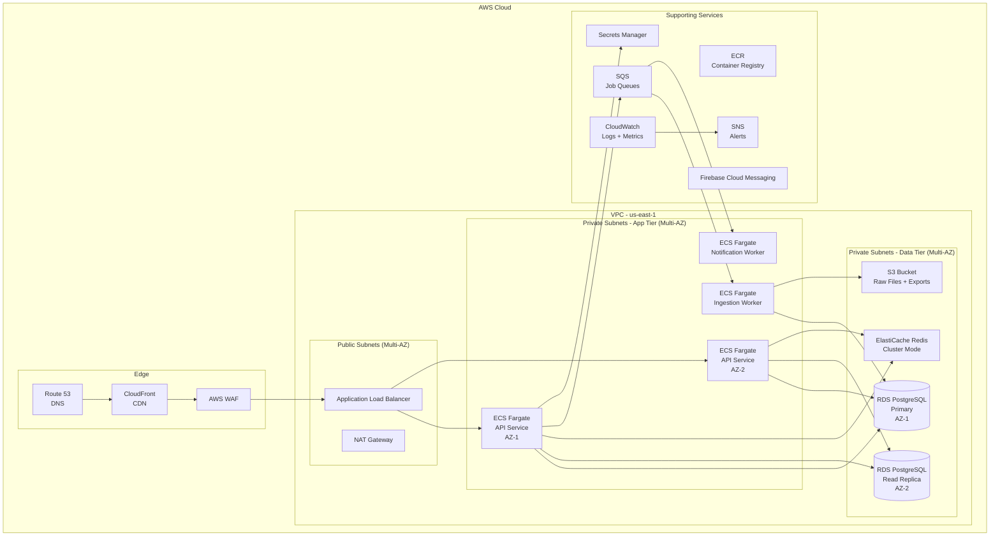
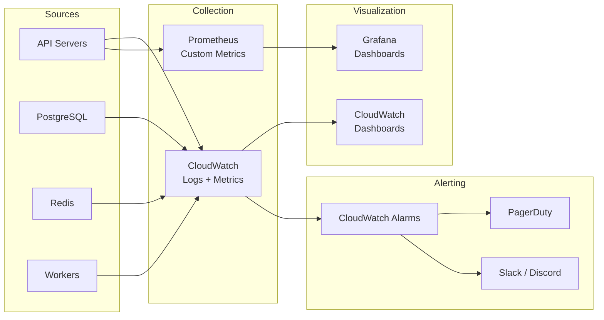

# Deployment Architecture
## Medical Sales Intelligence & CRM Platform

**Author:** Frank Reynolds, DevOps & Solutions Architect  
**Date:** February 28, 2026  
**Version:** 1.0

---

## 1. Overview

Three environments. Three purposes. No exceptions.

| Environment | Purpose | Infrastructure | Deploy Trigger |
|-------------|---------|----------------|----------------|
| **dev** | Development & integration testing | Minimal, single-instance | Push to `develop` branch |
| **staging** | Pre-production validation, QA | Production-like, scaled down | PR merge to `main` |
| **production** | Live traffic | Full HA, multi-AZ | Manual approval after staging QA |

---

## 2. Cloud Architecture (AWS)



---

## 3. Container Architecture

### 3.1 Docker Images

| Image | Base | Purpose | Size Target |
|-------|------|---------|-------------|
| `medsales-api` | `eclipse-temurin:21-jre-alpine` | Spring Boot API | < 200 MB |
| `medsales-worker` | `eclipse-temurin:21-jre-alpine` | Data ingestion / batch jobs | < 250 MB |
| `medsales-web` | `nginx:alpine` | React SPA static files | < 50 MB |

### 3.2 Dockerfile — API Service

```dockerfile
# Build stage
FROM eclipse-temurin:21-jdk-alpine AS build
WORKDIR /app
COPY gradle/ gradle/
COPY gradlew build.gradle settings.gradle ./
RUN ./gradlew dependencies --no-daemon
COPY src/ src/
RUN ./gradlew bootJar --no-daemon -x test

# Runtime stage
FROM eclipse-temurin:21-jre-alpine
RUN addgroup -S appgroup && adduser -S appuser -G appgroup
WORKDIR /app
COPY --from=build /app/build/libs/*.jar app.jar

# Health check
HEALTHCHECK --interval=30s --timeout=5s --retries=3 \
    CMD wget -qO- http://localhost:8080/health || exit 1

USER appuser
EXPOSE 8080

ENTRYPOINT ["java", \
    "-XX:+UseContainerSupport", \
    "-XX:MaxRAMPercentage=75.0", \
    "-Djava.security.egd=file:/dev/./urandom", \
    "-jar", "app.jar"]
```

### 3.3 Docker Compose — Development

```yaml
version: '3.8'

services:
  api:
    build:
      context: .
      dockerfile: Dockerfile
    ports:
      - "8080:8080"
    environment:
      - SPRING_PROFILES_ACTIVE=dev
      - DB_HOST=postgres
      - DB_PORT=5432
      - DB_NAME=medsales
      - DB_USER=medsales
      - DB_PASS=devpassword
      - REDIS_HOST=redis
      - REDIS_PORT=6379
    depends_on:
      postgres:
        condition: service_healthy
      redis:
        condition: service_healthy
    healthcheck:
      test: ["CMD", "wget", "-qO-", "http://localhost:8080/health"]
      interval: 30s
      timeout: 5s
      retries: 3

  worker:
    build:
      context: .
      dockerfile: Dockerfile.worker
    environment:
      - SPRING_PROFILES_ACTIVE=dev
      - DB_HOST=postgres
      - DB_PORT=5432
      - DB_NAME=medsales
      - DB_USER=medsales
      - DB_PASS=devpassword
      - S3_BUCKET=medsales-dev-data
    depends_on:
      postgres:
        condition: service_healthy

  postgres:
    image: postgis/postgis:16-3.4-alpine
    ports:
      - "5432:5432"
    environment:
      - POSTGRES_DB=medsales
      - POSTGRES_USER=medsales
      - POSTGRES_PASSWORD=devpassword
    volumes:
      - pgdata:/var/lib/postgresql/data
      - ./db/init:/docker-entrypoint-initdb.d
    healthcheck:
      test: ["CMD-SHELL", "pg_isready -U medsales"]
      interval: 10s
      timeout: 5s
      retries: 5

  redis:
    image: redis:7-alpine
    ports:
      - "6379:6379"
    healthcheck:
      test: ["CMD", "redis-cli", "ping"]
      interval: 10s
      timeout: 5s
      retries: 5

  web:
    build:
      context: ./web
      dockerfile: Dockerfile
    ports:
      - "3000:80"
    depends_on:
      - api

volumes:
  pgdata:
```

---

## 4. CI/CD Pipeline

### 4.1 Pipeline Architecture

```mermaid
graph LR
    subgraph "GitHub Actions"
        PR[Pull Request] --> LINT[Lint + Format]
        LINT --> TEST[Unit Tests]
        TEST --> BUILD[Build + Docker]
        BUILD --> SCAN[Container Scan<br>Trivy]
        SCAN --> PUSH[Push to ECR]
    end

    subgraph "Deploy Pipeline"
        PUSH --> DEV_DEPLOY[Deploy to Dev<br>Auto]
        DEV_DEPLOY --> INT_TEST[Integration Tests]
        INT_TEST --> STG_DEPLOY[Deploy to Staging<br>Auto on main]
        STG_DEPLOY --> QA[QA Validation]
        QA --> PROD_DEPLOY[Deploy to Prod<br>Manual Approval]
        PROD_DEPLOY --> HEALTH[Health Check]
        HEALTH --> DONE[✅ Live]
    end
```



### 4.2 GitHub Actions Workflow

```yaml
# .github/workflows/ci-cd.yml
name: CI/CD Pipeline

on:
  push:
    branches: [develop, main]
  pull_request:
    branches: [develop, main]

env:
  ECR_REGISTRY: ${{ secrets.AWS_ACCOUNT_ID }}.dkr.ecr.us-east-1.amazonaws.com
  API_IMAGE: medsales-api
  WORKER_IMAGE: medsales-worker
  WEB_IMAGE: medsales-web

jobs:
  test:
    runs-on: ubuntu-latest
    steps:
      - uses: actions/checkout@v4
      - uses: actions/setup-java@v4
        with:
          java-version: '21'
          distribution: 'temurin'
      - name: Run tests
        run: ./gradlew test
      - name: Upload test results
        uses: actions/upload-artifact@v4
        if: always()
        with:
          name: test-results
          path: build/reports/tests/

  build-and-push:
    needs: test
    runs-on: ubuntu-latest
    if: github.event_name == 'push'
    steps:
      - uses: actions/checkout@v4
      - uses: aws-actions/configure-aws-credentials@v4
        with:
          aws-access-key-id: ${{ secrets.AWS_ACCESS_KEY_ID }}
          aws-secret-access-key: ${{ secrets.AWS_SECRET_ACCESS_KEY }}
          aws-region: us-east-1
      - uses: aws-actions/amazon-ecr-login@v2
      - name: Build and push API image
        run: |
          docker build -t $ECR_REGISTRY/$API_IMAGE:${{ github.sha }} .
          docker tag $ECR_REGISTRY/$API_IMAGE:${{ github.sha }} $ECR_REGISTRY/$API_IMAGE:latest
          docker push $ECR_REGISTRY/$API_IMAGE:${{ github.sha }}
          docker push $ECR_REGISTRY/$API_IMAGE:latest
      - name: Scan image with Trivy
        uses: aquasecurity/trivy-action@master
        with:
          image-ref: ${{ env.ECR_REGISTRY }}/${{ env.API_IMAGE }}:${{ github.sha }}
          severity: 'CRITICAL,HIGH'
          exit-code: '1'

  deploy-dev:
    needs: build-and-push
    if: github.ref == 'refs/heads/develop'
    runs-on: ubuntu-latest
    environment: dev
    steps:
      - name: Deploy to ECS Dev
        run: |
          aws ecs update-service \
            --cluster medsales-dev \
            --service medsales-api \
            --force-new-deployment
      - name: Wait for stability
        run: |
          aws ecs wait services-stable \
            --cluster medsales-dev \
            --services medsales-api
      - name: Health check
        run: |
          curl -f https://dev-api.medsales.io/health || exit 1

  deploy-staging:
    needs: build-and-push
    if: github.ref == 'refs/heads/main'
    runs-on: ubuntu-latest
    environment: staging
    steps:
      - name: Deploy to ECS Staging
        run: |
          aws ecs update-service \
            --cluster medsales-staging \
            --service medsales-api \
            --force-new-deployment
      - name: Health check
        run: |
          curl -f https://staging-api.medsales.io/health || exit 1

  deploy-production:
    needs: deploy-staging
    runs-on: ubuntu-latest
    environment:
      name: production
      url: https://api.medsales.io
    steps:
      - name: Deploy to ECS Production
        run: |
          aws ecs update-service \
            --cluster medsales-prod \
            --service medsales-api \
            --force-new-deployment
      - name: Wait for stability
        run: |
          aws ecs wait services-stable \
            --cluster medsales-prod \
            --services medsales-api
      - name: Health check
        run: |
          curl -f https://api.medsales.io/health || exit 1
```

---

## 5. Infrastructure as Code

### 5.1 Terraform Structure

```
terraform/
├── modules/
│   ├── vpc/              # VPC, subnets, NAT, security groups
│   ├── ecs/              # ECS cluster, services, task definitions
│   ├── rds/              # RDS PostgreSQL + PostGIS
│   ├── elasticache/      # Redis cluster
│   ├── alb/              # Application Load Balancer
│   ├── s3/               # S3 buckets
│   ├── ecr/              # Container registry
│   └── monitoring/       # CloudWatch, alarms, dashboards
├── environments/
│   ├── dev/
│   │   └── main.tf       # Dev-specific config
│   ├── staging/
│   │   └── main.tf       # Staging config
│   └── production/
│       └── main.tf       # Production config
└── variables.tf
```

### 5.2 Environment Sizing

| Resource | Dev | Staging | Production |
|----------|-----|---------|------------|
| **ECS API Tasks** | 1 | 2 | 4+ (auto-scale) |
| **ECS Worker Tasks** | 1 | 1 | 2 |
| **RDS Instance** | db.t3.medium | db.r6g.large | db.r6g.2xlarge |
| **RDS Read Replica** | — | 1 | 2 |
| **RDS Storage** | 100 GB | 250 GB | 500 GB (auto-expand) |
| **Redis** | cache.t3.micro | cache.r6g.large | cache.r6g.xlarge (cluster) |
| **ALB** | Shared | Dedicated | Dedicated |
| **S3** | Standard | Standard | Standard + IA lifecycle |
| **Multi-AZ** | No | No | Yes |
| **WAF** | No | No | Yes |
| **Estimated Monthly Cost** | ~$200 | ~$800 | ~$3,500 |

---

## 6. Monitoring & Observability

### 6.1 Monitoring Stack



### 6.2 Key Metrics & Alerts

| Metric | Warning | Critical | Action |
|--------|---------|----------|--------|
| API response time (p95) | > 2s | > 5s | Scale out API tasks |
| API error rate (5xx) | > 1% | > 5% | Page on-call |
| Database CPU | > 70% | > 90% | Scale up RDS |
| Database connections | > 80% pool | > 95% pool | Scale connections / add replica |
| Redis memory | > 70% | > 85% | Eviction review |
| Redis hit rate | < 80% | < 60% | Cache tuning |
| Disk I/O (RDS) | > 70% baseline | > 90% baseline | Provision IOPS |
| ECS task health | Any unhealthy | > 50% unhealthy | Auto-replace / investigate |
| Ingestion job failure | — | Any failure | Alert ops, manual retry |
| Certificate expiry | < 30 days | < 7 days | Auto-renew (ACM) |

### 6.3 Health Check Endpoint

```json
GET /health

{
  "status": "UP",
  "components": {
    "database": { "status": "UP", "responseTimeMs": 12 },
    "redis": { "status": "UP", "responseTimeMs": 2 },
    "diskSpace": { "status": "UP", "freeBytes": 85899345920 }
  },
  "dataFreshness": {
    "nppes": { "lastIngested": "2026-02-15T02:00:00Z", "recordCount": 5234567 },
    "partB": { "lastIngested": "2026-01-10T02:00:00Z", "dataYear": 2024 },
    "partD": { "lastIngested": "2026-01-10T02:00:00Z", "dataYear": 2024 },
    "openPayments": { "lastIngested": "2025-12-20T02:00:00Z", "dataYear": 2024 }
  }
}
```

---

## 7. Security Hardening

| Layer | Measure |
|-------|---------|
| **Network** | VPC with private subnets; no direct internet access to app/data tier |
| **Access** | NAT gateway for outbound only; bastion host for emergency DB access |
| **TLS** | ACM certificates; TLS 1.2+ enforced at ALB |
| **WAF** | AWS WAF with OWASP Top 10 rule set |
| **Secrets** | AWS Secrets Manager; rotated every 90 days |
| **Images** | Trivy scan in CI; no CRITICAL/HIGH CVEs allowed |
| **IAM** | Least-privilege task roles; no `*` policies |
| **Encryption** | RDS encryption at rest (AES-256); S3 SSE-S3 |
| **Audit** | CloudTrail enabled; API audit logs to CloudWatch |
| **Compliance** | SOC 2 Type II target within 18 months |

---

## 8. Disaster Recovery

| Scenario | RTO | RPO | Procedure |
|----------|-----|-----|-----------|
| Single AZ failure | 0 (auto) | 0 | Multi-AZ RDS failover; ECS re-schedules tasks |
| Full region failure | 4 hours | 1 hour | Promote DR standby in us-west-2; update DNS |
| Data corruption | 4 hours | 1 hour | Point-in-time restore from RDS backup |
| Bad deployment | 5 minutes | 0 | ECS rollback to previous task definition |

### Rollback Procedure

```bash
# Quick rollback to previous version
aws ecs update-service \
  --cluster medsales-prod \
  --service medsales-api \
  --task-definition medsales-api:<previous-revision>

# Verify
aws ecs wait services-stable --cluster medsales-prod --services medsales-api
curl -f https://api.medsales.io/health
```

---

## 9. Cost Estimates

### Monthly Production Cost Breakdown

| Service | Estimate |
|---------|----------|
| ECS Fargate (API + Workers) | ~$600 |
| RDS PostgreSQL (primary + replica) | ~$1,200 |
| ElastiCache Redis | ~$400 |
| ALB | ~$200 |
| S3 (storage + transfer) | ~$100 |
| CloudFront CDN | ~$100 |
| NAT Gateway | ~$200 |
| CloudWatch + Monitoring | ~$150 |
| Secrets Manager | ~$50 |
| WAF | ~$100 |
| Data transfer | ~$200 |
| **Total** | **~$3,300/month** |

### One-Time Costs

| Item | Estimate |
|------|----------|
| Initial geocoding (~5M addresses) | ~$25,000 |
| Terraform setup & automation | Engineering time |
| SOC 2 audit (when ready) | ~$30,000-$50,000 |

---

*Here's the deal with infrastructure: you either invest up front or you pay triple later when it falls over at 3am. I've seen it both ways. Invest up front.*
