# Geocoding Service Architecture
## Medical Sales Intelligence & CRM Platform

**Author:** Frank Reynolds, DevOps & Solutions Architect  
**Date:** February 28, 2026  
**Version:** 1.0

---

## 1. Why a Separate Service

Geocoding — converting street addresses to latitude/longitude coordinates — is the backbone of every location feature in this platform. Nearby physician search, map pins, distance calculations, route export — none of it works without geocoded addresses.

Here's the problem: we have **~5 million physician addresses** on initial load, plus **~8 million total address records** (location + mailing). Every month, NPPES pushes ~200,000 address updates. Every quarter, the Provider Data Catalog adds more. Geocoding at this scale is:

1. **Expensive** — $5/1,000 calls at Google Maps standard rates = ~$25,000 for initial load
2. **Rate-limited** — Google Maps caps at 50 QPS (queries per second) by default
3. **Slow** — At 50 QPS, 5 million addresses takes ~28 hours of continuous processing
4. **Failure-prone** — APIs timeout, addresses are malformed, rate limits get hit
5. **Ongoing** — Not a one-time job; runs with every data refresh

This doesn't belong in the data ingestion pipeline. It needs its own service with its own queue, retry logic, rate limiting, caching, and monitoring.

---

## 2. Service Architecture


---

## 3. How It Works — End to End

### 3.1 Trigger: Data Ingestion Detects Address Changes

The geocoding service doesn't decide what to geocode. The ingestion pipeline tells it.


### 3.2 Address Diff Detection

Not every ingestion run needs to geocode everything. The diff engine compares:

```sql
-- Find addresses that need geocoding
SELECT pa.id, pa.npi, pa.address_line_1, pa.city, pa.state, pa.zip5
FROM physician_address pa
WHERE pa.geom IS NULL                           -- Never geocoded
   OR pa.address_line_1 != pa.prev_address_line_1  -- Address changed
   OR pa.city != pa.prev_city
   OR pa.state != pa.prev_state
   OR pa.zip5 != pa.prev_zip5;
```

The ingestion worker tracks previous address values in shadow columns or a change-tracking table to detect what actually changed.

---

## 4. Address Normalization

Raw CMS addresses are messy. Before hitting any geocoding API, addresses go through normalization:

```mermaid
graph LR
    RAW[Raw CMS Address<br>"123 N Main St Ste 200<br>SPRINGFIELD, IL 62701"] 
    --> NORM[Normalizer]
    --> CLEAN["123 North Main Street Suite 200<br>Springfield, IL 62701"]
    --> HASH[SHA-256 Hash]
    --> CACHE_KEY["Cache Lookup Key"]
```

### Normalization Rules

| Rule | Example Before | Example After |
|------|---------------|---------------|
| Expand abbreviations | `N Main St Ste 200` | `North Main Street Suite 200` |
| Standardize case | `SPRINGFIELD` | `Springfield` |
| Remove special chars | `123 Main St.` | `123 Main St` |
| Standardize unit format | `#200`, `Ste. 200`, `Suite #200` | `Suite 200` |
| Remove C/O lines | `C/O Dr Smith` | *(removed)* |
| Trim whitespace | `123  Main   St` | `123 Main St` |
| Validate ZIP format | `627011234` | `62701` (5-digit) |
| PO Box detection | `PO Box 123` | Flag as non-geocodable |

### Why This Matters

1. **Cache hit rate** — Normalized addresses hash consistently. `123 N Main St` and `123 North Main Street` produce the same cache key → fewer API calls → less money.
2. **API accuracy** — Clean addresses get better geocoding results. Garbage in, garbage out.
3. **Deduplication** — Multiple physicians at the same office should produce one geocoding call, not five.

**Estimated cache hit rate with normalization: ~60%** (many physicians share office addresses in medical buildings, hospital clinics, etc.)

Without normalization: ~20% cache hit rate. That's the difference between $25K and $10K on initial load.

---

## 5. Provider Strategy — Multi-Provider with Fallback

Don't put all your eggs in one geocoding basket. APIs go down. Rate limits get hit. Prices change.

### 5.1 Provider Hierarchy

```mermaid
graph TD
    ADDR[Normalized Address]
    
    ADDR --> CACHE{Redis Cache?}
    CACHE -->|Hit| DONE[✅ Use cached result]
    CACHE -->|Miss| GOOGLE{Google Maps<br>Geocoding API}
    
    GOOGLE -->|Success + High Confidence| DONE
    GOOGLE -->|Failure / Low Confidence / Quota| MAPBOX{Mapbox<br>Geocoding API}
    
    MAPBOX -->|Success + High Confidence| DONE
    MAPBOX -->|Failure / Low Confidence| CENSUS{US Census<br>Geocoder}
    
    CENSUS -->|Success| DONE2[✅ Use result<br>Flag: lower accuracy]
    CENSUS -->|Failure| FAILED[❌ Mark as<br>GEOCODE_FAILED<br>Queue for manual review]
```



### 5.2 Provider Comparison

| Provider | Cost | Rate Limit | Accuracy | Notes |
|----------|------|-----------|----------|-------|
| **Google Maps Geocoding** | $5/1,000 requests | 50 QPS default (can increase) | Excellent | Best accuracy; rooftop-level for most US addresses |
| **Mapbox Geocoding** | $0.75/1,000 requests (first 100K free/mo) | 600 RPM | Very Good | Much cheaper; good fallback; free tier helps with dev/staging |
| **US Census Geocoder** | **Free** | ~100/min (unofficial) | Good for street-level | No cost; slower; batch endpoint available; US addresses only |
| **Nominatim (OpenStreetMap)** | **Free** | 1 QPS (public) | Variable | Free but strict rate limits; self-host for more throughput |

### 5.3 Cost Optimization Strategy

| Scenario | Volume | Strategy | Estimated Cost |
|----------|--------|----------|----------------|
| **Initial Load** | ~5M addresses | Census batch first (free), Google for failures | ~$10,000–15,000 |
| **Monthly Refresh** | ~200K addresses | Cache first (~60% hit), Google for rest | ~$400/month |
| **Quarterly Refresh** | ~500K addresses | Cache first, Google for rest | ~$1,000 |
| **Dev/Staging** | Any | Mapbox free tier (100K/mo free) | $0 |

#### Initial Load Strategy — Save $15K

Here's the scheme. The US Census Bureau has a **free batch geocoder** that accepts up to 10,000 addresses per file. It's not fast, but it's free. For 5 million addresses:

1. **Round 1 — Census Batch** (free): Submit all 5M addresses in batches of 10,000. Takes ~48 hours. Gets ~85% of addresses with street-level or better accuracy.
2. **Round 2 — Google Maps** (paid): Send the ~750K addresses that Census couldn't resolve (no match, low confidence, or PO boxes near actual locations). Cost: ~$3,750.
3. **Round 3 — Mapbox** (cheap): Send remaining failures through Mapbox as a second opinion. Cost: minimal.
4. **Round 4 — Manual review queue**: The remaining ~1-2% that nobody can geocode. Flag for manual review.

**Total initial cost: ~$4,000–5,000 instead of $25,000.** You're welcome.

---

## 6. Geocode Quality & Confidence

Not all geocode results are created equal. A result can be:

| Accuracy Level | Description | Use Case |
|----------------|-------------|----------|
| **ROOFTOP** | Exact building location | Full confidence. Show on map. |
| **RANGE_INTERPOLATED** | Approximate position on street segment | Good enough for map display and radius search |
| **GEOMETRIC_CENTER** | Center of a region (ZIP, city) | ⚠️ Not precise. Flag on UI. |
| **APPROXIMATE** | Very rough estimate | ⚠️ Show with warning. Don't use for distance calculations. |

### Quality Tracking Schema

```sql
CREATE TABLE geocode_result (
    id                  UUID PRIMARY KEY DEFAULT gen_random_uuid(),
    address_id          UUID NOT NULL REFERENCES physician_address(id),
    npi                 VARCHAR(10) NOT NULL,
    
    -- Input
    input_address       TEXT NOT NULL,
    normalized_address  TEXT NOT NULL,
    address_hash        VARCHAR(64) NOT NULL,  -- SHA-256 of normalized address
    
    -- Result
    latitude            DECIMAL(9,6),
    longitude           DECIMAL(9,6),
    accuracy            VARCHAR(30),           -- ROOFTOP, RANGE_INTERPOLATED, etc.
    confidence_score    DECIMAL(3,2),           -- 0.00 - 1.00
    formatted_address   TEXT,                   -- Provider's formatted version
    place_id            VARCHAR(200),           -- Google's place_id
    
    -- Provider info
    provider            VARCHAR(20) NOT NULL,   -- google, mapbox, census
    provider_response   JSONB,                  -- Full API response (for debugging)
    
    -- Metadata
    geocoded_at         TIMESTAMP NOT NULL DEFAULT NOW(),
    attempt_count       INT DEFAULT 1,
    status              VARCHAR(20) NOT NULL,   -- SUCCESS, LOW_CONFIDENCE, FAILED, PO_BOX
    error_message       TEXT,
    
    -- Cache control
    cache_hit           BOOLEAN DEFAULT FALSE,
    cache_key           VARCHAR(64)
);

CREATE INDEX idx_geocode_npi ON geocode_result (npi);
CREATE INDEX idx_geocode_status ON geocode_result (status);
CREATE INDEX idx_geocode_accuracy ON geocode_result (accuracy);
CREATE INDEX idx_geocode_hash ON geocode_result (address_hash);
```

### Quality Dashboard Metrics

| Metric | Target | Alert Threshold |
|--------|--------|-----------------|
| Geocode success rate | > 98% | < 95% |
| ROOFTOP accuracy rate | > 80% | < 70% |
| Average geocode latency | < 200ms | > 500ms |
| Cache hit rate | > 55% | < 40% |
| Failed geocode queue size | < 1,000 | > 5,000 |
| Provider error rate | < 1% | > 3% |

---

## 7. Rate Limiting & Throttling

### 7.1 Token Bucket Rate Limiter


| Provider | API Limit | Our Limit (safety margin) | Burst Capacity |
|----------|-----------|---------------------------|----------------|
| Google Maps | 50 QPS | 45 QPS | 50 |
| Mapbox | 600 RPM (~10 QPS) | 8 QPS | 15 |
| Census | ~100 RPM (~1.7 QPS) | 1.5 QPS | 5 |

### 7.2 Backoff Strategy

```
Attempt 1: Immediate
Attempt 2: Wait 1 second
Attempt 3: Wait 5 seconds
Attempt 4: Wait 30 seconds
Attempt 5: Wait 5 minutes
Attempt 6+: Move to dead letter queue, alert ops
```

### 7.3 Quota Monitoring

```mermaid
sequenceDiagram
    participant WORKER as Geocode Worker
    participant GOOGLE as Google Maps API
    participant MONITOR as Quota Monitor
    participant ALERT as Alert System

    WORKER->>GOOGLE: Geocode request
    GOOGLE-->>WORKER: 429 Too Many Requests
    WORKER->>MONITOR: Report rate limit hit
    MONITOR->>MONITOR: Check daily quota usage
    
    alt Quota > 80%
        MONITOR->>ALERT: ⚠️ Quota warning
        MONITOR->>WORKER: Switch to Mapbox
    end
    
    alt Quota > 95%
        MONITOR->>ALERT: 🚨 Quota critical
        MONITOR->>WORKER: Switch to Census (free)
    end
```



---

## 8. Batch Processing — Initial Load

The initial 5 million address geocoding is a special operation. Here's the step-by-step:

### 8.1 Initial Load Pipeline

```mermaid
graph TD
    subgraph "Phase 1: Prepare (Day 1)"
        EXTRACT[Extract unique addresses<br>from physician_address]
        NORM2[Normalize all addresses]
        DEDUP2[Deduplicate by hash<br>~5M → ~3.2M unique]
    end

    subgraph "Phase 2: Census Batch (Days 2-4)"
        SPLIT[Split into 10K-row CSV files]
        SUBMIT[Submit to Census Batch API<br>~320 files]
        COLLECT[Collect results<br>~85% success rate]
        STORE1[Store results + cache]
    end

    subgraph "Phase 3: Google (Days 5-6)"
        FAILED1[~480K addresses without geocode]
        GOOGLE2[Send through Google Maps API<br>at 45 QPS]
        STORE2[Store results + cache]
    end

    subgraph "Phase 4: Cleanup (Day 7)"
        FAILED2[~15K remaining failures]
        MAPBOX2[Try Mapbox]
        MANUAL[Manual review queue<br>~5K addresses]
        UPDATE[Bulk update physician_address<br>SET geom = ...]
    end

    EXTRACT --> NORM2 --> DEDUP2
    DEDUP2 --> SPLIT --> SUBMIT --> COLLECT --> STORE1
    STORE1 --> FAILED1 --> GOOGLE2 --> STORE2
    STORE2 --> FAILED2 --> MAPBOX2 --> MANUAL --> UPDATE
```



### 8.2 Timeline & Cost Estimate

| Phase | Duration | API Calls | Cost |
|-------|----------|-----------|------|
| Prepare | 2 hours | 0 | $0 |
| Census Batch | ~48 hours | 3.2M (free) | $0 |
| Google Maps | ~3 hours (480K @ 45 QPS) | ~480K | ~$2,400 |
| Mapbox | ~30 min | ~15K | ~$11 |
| Manual review | Ongoing | 0 | Staff time |
| **Total** | **~3 days** | **~3.7M** | **~$2,500** |

Compare to naive approach (all Google): $25,000. **90% cost reduction.**

---

## 9. Ongoing Geocoding — Monthly/Quarterly

### 9.1 Monthly NPPES Refresh


**Monthly cost: ~$400** (80K requests × $5/1,000)

### 9.2 Re-Geocoding Strategy

Addresses that were geocoded more than 12 months ago should be re-verified, because:
- Google improves their address database
- Buildings get demolished or built
- Suites and floor numbers get updated

Schedule: Low-priority background re-geocode of 1/12th of the database each month (rolling 12-month cycle). Use off-peak hours. Cost: ~$1,700/month if all cache-miss, but with 60% cache hits: ~$700/month.

---

## 10. Service Configuration

### 10.1 Application Properties

```yaml
# geocoding-service/application.yml

geocoding:
  # Provider configuration
  providers:
    google:
      api-key: ${GOOGLE_MAPS_API_KEY}
      rate-limit-qps: 45
      timeout-ms: 5000
      retry-max: 3
      enabled: true
      priority: 1
    mapbox:
      api-key: ${MAPBOX_API_KEY}
      rate-limit-qps: 8
      timeout-ms: 5000
      retry-max: 3
      enabled: true
      priority: 2
    census:
      base-url: https://geocoding.geo.census.gov/geocoder
      rate-limit-qps: 1.5
      timeout-ms: 30000
      retry-max: 2
      enabled: true
      priority: 3

  # Cache configuration
  cache:
    enabled: true
    ttl-days: 90
    redis-prefix: "geocode:"

  # Worker configuration
  workers:
    pool-size: 4
    queue-name: geocode-jobs
    dead-letter-queue: geocode-dlq
    batch-size: 100

  # Quality thresholds
  quality:
    min-confidence: 0.7
    acceptable-accuracy:
      - ROOFTOP
      - RANGE_INTERPOLATED
    flag-accuracy:
      - GEOMETRIC_CENTER
      - APPROXIMATE

  # Monitoring
  monitoring:
    quota-warning-percent: 80
    quota-critical-percent: 95
    alert-on-failure-rate: 0.03
    metrics-export: prometheus
```

### 10.2 Docker Setup

```yaml
# docker-compose addition for geocoding service
  geocoding-service:
    build:
      context: ./geocoding-service
      dockerfile: Dockerfile
    ports:
      - "8081:8081"
    environment:
      - SPRING_PROFILES_ACTIVE=dev
      - DB_HOST=postgres
      - DB_PORT=5432
      - DB_NAME=medsales
      - DB_USER=medsales
      - DB_PASS=devpassword
      - REDIS_HOST=redis
      - REDIS_PORT=6379
      - GOOGLE_MAPS_API_KEY=${GOOGLE_MAPS_API_KEY}
      - MAPBOX_API_KEY=${MAPBOX_API_KEY}
      - SQS_QUEUE_URL=${GEOCODE_QUEUE_URL}
    depends_on:
      postgres:
        condition: service_healthy
      redis:
        condition: service_healthy
    healthcheck:
      test: ["CMD", "wget", "-qO-", "http://localhost:8081/health"]
      interval: 30s
      timeout: 5s
      retries: 3
```

---

## 11. API Endpoints (Internal)

The geocoding service exposes internal endpoints only — not accessible from the public internet.

| Method | Endpoint | Description |
|--------|----------|-------------|
| POST | `/geocode/single` | Geocode a single address (synchronous) |
| POST | `/geocode/batch` | Submit batch of addresses (async, returns job ID) |
| GET | `/geocode/job/{jobId}` | Check batch job status |
| GET | `/geocode/stats` | Current geocoding statistics |
| GET | `/geocode/quota` | Provider quota usage |
| GET | `/geocode/failures` | List failed geocoding attempts |
| POST | `/geocode/retry/{addressId}` | Retry a failed geocode |
| GET | `/health` | Service health check |

### Example: Batch Submit

```json
POST /geocode/batch
{
  "priority": "HIGH",
  "source": "nppes_monthly_202602",
  "addresses": [
    {
      "address_id": "a1b2c3d4-...",
      "npi": "1234567890",
      "street": "123 North Main Street Suite 200",
      "city": "Springfield",
      "state": "IL",
      "zip": "62701"
    },
    ...
  ]
}

Response:
{
  "job_id": "job-abc123",
  "total_addresses": 5000,
  "estimated_time_seconds": 180,
  "status": "QUEUED"
}
```

### Example: Job Status

```json
GET /geocode/job/job-abc123

{
  "job_id": "job-abc123",
  "status": "IN_PROGRESS",
  "total": 5000,
  "completed": 3200,
  "cache_hits": 1900,
  "api_calls": 1300,
  "failed": 12,
  "providers_used": {
    "cache": 1900,
    "google": 1280,
    "mapbox": 15,
    "census": 5
  },
  "estimated_remaining_seconds": 40
}
```

---

## 12. Deployment Model


| Resource | Dev | Staging | Production |
|----------|-----|---------|------------|
| ECS Tasks | 1 | 1 | 2 |
| CPU / Memory | 0.5 vCPU / 1 GB | 1 vCPU / 2 GB | 2 vCPU / 4 GB |
| SQS Queue | Standard | Standard | Standard |
| Est. Monthly Cost | ~$20 | ~$50 | ~$100 (service) + API costs |

---

## 13. Monitoring & Alerts

| Metric | Description | Alert |
|--------|-------------|-------|
| `geocode.requests.total` | Total geocode requests | — |
| `geocode.cache.hit_rate` | Cache hit percentage | < 40% |
| `geocode.provider.{name}.calls` | Calls per provider | — |
| `geocode.provider.{name}.errors` | Error rate per provider | > 3% |
| `geocode.provider.{name}.latency_p95` | Provider response time | > 1s |
| `geocode.queue.depth` | Pending jobs in queue | > 10,000 |
| `geocode.dlq.depth` | Failed jobs in dead letter | > 100 |
| `geocode.quota.google.percent` | Google daily quota usage | > 80% |
| `geocode.accuracy.rooftop_rate` | Percentage at rooftop accuracy | < 70% |

---

*Look — geocoding isn't glamorous. Nobody's going to give you an award for turning "123 N Main St" into "39.7817, -89.6501". But if you don't do it right, every map in the app is wrong, every "nearby" search returns garbage, and your sales reps are driving to the wrong office. Get this right first. Everything else depends on it.*
