# Authentication Flows
## MedSales Identity Provider

**Author:** Frank Reynolds, Solutions Architect & DevOps  
**Date:** February 28, 2026  
**Version:** 1.0

---

## 1. OAuth 2.0 Authorization Code + PKCE (Mobile App Login)

Used by the React Native mobile app and the React web app. PKCE is mandatory — no client secrets stored on devices.

```mermaid
sequenceDiagram
    participant User as 📱 User (Mobile App)
    participant App as React Native App
    participant IDP as IdP Service (8081)
    participant DB as PostgreSQL

    App->>App: Generate code_verifier + code_challenge (S256)
    App->>IDP: GET /idp/oauth2/authorize<br>?response_type=code<br>&client_id=medsales-mobile<br>&redirect_uri=medsales://callback<br>&code_challenge=...&code_challenge_method=S256<br>&scope=openid profile org
    IDP->>User: Present login form
    User->>IDP: POST email + password
    IDP->>DB: Validate credentials (bcrypt)
    DB-->>IDP: User record

    alt MFA enabled for user
        IDP->>User: MFA challenge (see Flow 4)
        User->>IDP: TOTP code
        IDP->>IDP: Verify TOTP
    end

    IDP->>DB: Store authorization code (TTL 5min)
    IDP-->>App: 302 Redirect to medsales://callback?code=AUTH_CODE

    App->>IDP: POST /idp/oauth2/token<br>grant_type=authorization_code<br>&code=AUTH_CODE<br>&code_verifier=...<br>&redirect_uri=medsales://callback
    IDP->>DB: Validate auth code + PKCE verifier
    IDP->>IDP: Generate JWT access token (RS256, 15min)
    IDP->>DB: Store refresh token (hashed, 30-day TTL)
    IDP->>DB: Create session record
    IDP->>DB: Audit log: LOGIN_SUCCESS
    IDP-->>App: 200 OK<br>{ access_token, refresh_token, expires_in: 900, token_type: "Bearer" }
```



### JWT Access Token Claims

```json
{
  "iss": "https://idp.medsales.io",
  "sub": "user-uuid",
  "aud": "medsales-api",
  "exp": 1709150400,
  "iat": 1709149500,
  "org_id": "org-uuid",
  "roles": ["rep"],
  "scope": "openid profile org",
  "jti": "unique-token-id"
}
```

---

## 2. Client Credentials Flow (API Integrations)

Used by external systems (CRM integrations, data warehouses, partner APIs) that authenticate as an organization, not a user.

```mermaid
sequenceDiagram
    participant Client as 🔌 External System
    participant IDP as IdP Service (8081)
    participant DB as PostgreSQL

    Client->>IDP: POST /idp/oauth2/token<br>grant_type=client_credentials<br>&client_id=org-integration-key<br>&client_secret=api-secret<br>&scope=api:read api:write
    IDP->>DB: Validate API key + secret (bcrypt hash)
    DB-->>IDP: API key record (org_id, scopes, status)

    alt API key inactive or expired
        IDP-->>Client: 401 Unauthorized
    end

    IDP->>IDP: Generate JWT access token (RS256, 1hr)
    IDP->>DB: Audit log: CLIENT_AUTH_SUCCESS
    IDP-->>Client: 200 OK<br>{ access_token, expires_in: 3600, token_type: "Bearer" }
```



### Client Credentials JWT Claims

```json
{
  "iss": "https://idp.medsales.io",
  "sub": "apikey-uuid",
  "aud": "medsales-api",
  "exp": 1709153100,
  "iat": 1709149500,
  "org_id": "org-uuid",
  "client_type": "api_key",
  "scope": "api:read api:write",
  "jti": "unique-token-id"
}
```

---

## 3. Refresh Token Rotation

Refresh tokens are rotated on every use. The old token is invalidated immediately. This limits the blast radius of a leaked refresh token.


### Token Family Tracking

Each login creates a "token family." All refresh tokens from that login share a `family_id`. If a used token is presented again (reuse detection), the entire family is revoked — this handles the scenario where an attacker captured a refresh token that the legitimate client already used.

---

## 4. MFA Challenge Flow (TOTP)

Triggered during login when the user has MFA enabled. Uses standard TOTP (RFC 6238) — compatible with Google Authenticator, Authy, 1Password, etc.

### 4.1 MFA Enrollment


### 4.2 MFA Challenge During Login

```mermaid
sequenceDiagram
    participant User as 👤 User
    participant App as Mobile App
    participant IDP as IdP Service (8081)
    participant DB as PostgreSQL

    Note over User,App: After password verification succeeds...

    IDP-->>App: 200 OK<br>{ mfa_required: true, mfa_token: "temp-token", mfa_methods: ["totp"] }

    App->>User: Show TOTP input screen
    User->>User: Open authenticator app
    User->>App: Enter 6-digit code
    App->>IDP: POST /idp/oauth2/mfa/challenge<br>{ mfa_token: "temp-token", code: "123456", method: "totp" }
    IDP->>DB: Lookup user MFA secret
    IDP->>IDP: Validate TOTP (±1 time step window)

    alt Code valid
        IDP->>DB: Audit log: MFA_SUCCESS
        IDP->>IDP: Continue with authorization code issuance
        IDP-->>App: 302 Redirect with auth code
    else Code invalid
        IDP->>DB: Audit log: MFA_FAILURE
        IDP->>DB: Increment failure count
        alt 5+ failures
            IDP->>DB: Lock account (30min)
            IDP->>DB: Audit log: ACCOUNT_LOCKED
            IDP-->>App: 423 Locked
        else
            IDP-->>App: 401 Invalid MFA code
        end
    end
```



---

## 5. Token Introspection (Main API Validates Tokens)

The main MedSales API validates JWTs on every request. Two strategies, used together:

### 5.1 Local JWT Validation (Primary — No Network Call)


### 5.2 Token Introspection Endpoint (Fallback / Opaque Tokens)

Used when the API needs to check if a token has been revoked (e.g., after a security incident), or for validating opaque refresh tokens.


---

## 6. Token Lifecycle Summary

```mermaid
graph LR
    subgraph "Token Types"
        AC[Authorization Code<br>TTL: 5 min<br>Single use]
        AT[Access Token (JWT)<br>TTL: 15 min<br>RS256 signed]
        RT[Refresh Token (Opaque)<br>TTL: 30 days<br>Rotated on use]
        MFA_T[MFA Token<br>TTL: 5 min<br>Single use]
        AK[API Key<br>TTL: configurable<br>Org-scoped]
    end

    AC -->|Exchange| AT
    AC -->|Exchange| RT
    RT -->|Rotate| AT
    RT -->|Rotate| RT
    MFA_T -->|After MFA success| AC
    AK -->|Client credentials| AT
```

---

*Five flows. Five diagrams. That's the whole auth story. Every login, every token refresh, every API call — it goes through one of these paths. No exceptions. No shortcuts. No "we'll add auth later."*
