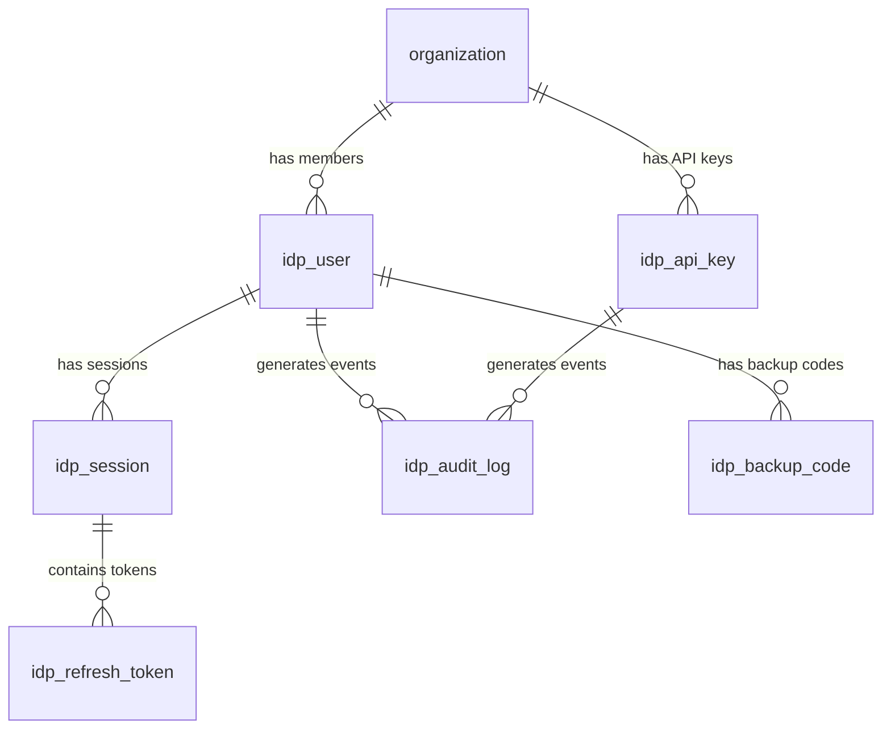

# Database Schema
## MedSales Identity Provider

**Author:** Frank Reynolds, Solutions Architect & DevOps  
**Date:** February 28, 2026  
**Version:** 1.0

---

## 1. Overview

The IdP uses the shared PostgreSQL cluster but maintains its own tables with an `idp_` prefix. Some tables reference the existing CRM `organization` table — the IdP doesn't duplicate org management, it consumes it.



---

## 2. Schema DDL

```sql
-- =============================================================
-- IDENTITY PROVIDER SCHEMA
-- All tables prefixed with idp_ to avoid collision with CRM tables
-- =============================================================

-- ----- USERS -----
CREATE TABLE idp_user (
    id              UUID PRIMARY KEY DEFAULT gen_random_uuid(),
    org_id          UUID NOT NULL REFERENCES organization(id),
    email           VARCHAR(255) NOT NULL,
    password_hash   VARCHAR(255) NOT NULL,  -- bcrypt, cost factor 12
    mfa_secret      VARCHAR(255),           -- AES-256 encrypted TOTP secret
    mfa_status      VARCHAR(20) NOT NULL DEFAULT 'DISABLED',  -- DISABLED | PENDING | ACTIVE
    roles           VARCHAR[] NOT NULL DEFAULT '{rep}',  -- rep, manager, admin, org_admin, super_admin
    status          VARCHAR(20) NOT NULL DEFAULT 'ACTIVE',  -- ACTIVE | LOCKED | SUSPENDED | DEACTIVATED
    full_name       VARCHAR(255) NOT NULL,
    email_verified  BOOLEAN NOT NULL DEFAULT FALSE,
    failed_login_attempts INT NOT NULL DEFAULT 0,
    locked_until    TIMESTAMP,
    last_login_at   TIMESTAMP,
    password_changed_at TIMESTAMP NOT NULL DEFAULT NOW(),
    created_at      TIMESTAMP NOT NULL DEFAULT NOW(),
    updated_at      TIMESTAMP NOT NULL DEFAULT NOW(),
    
    CONSTRAINT uq_idp_user_email UNIQUE (email),
    CONSTRAINT uq_idp_user_org_email UNIQUE (org_id, email)
);

CREATE INDEX idx_idp_user_org ON idp_user (org_id);
CREATE INDEX idx_idp_user_status ON idp_user (status);
CREATE INDEX idx_idp_user_email_lower ON idp_user (LOWER(email));

-- ----- ORGANIZATIONS -----
-- NOTE: We use the existing CRM organization table.
-- The IdP adds org-level auth settings via this extension table.
CREATE TABLE idp_org_settings (
    org_id                  UUID PRIMARY KEY REFERENCES organization(id),
    mfa_required            BOOLEAN NOT NULL DEFAULT FALSE,
    password_min_length     INT NOT NULL DEFAULT 12,
    password_require_upper  BOOLEAN NOT NULL DEFAULT TRUE,
    password_require_number BOOLEAN NOT NULL DEFAULT TRUE,
    password_require_special BOOLEAN NOT NULL DEFAULT TRUE,
    password_expiry_days    INT,  -- NULL = no expiry
    max_sessions_per_user   INT NOT NULL DEFAULT 5,
    session_timeout_minutes INT NOT NULL DEFAULT 480,  -- 8 hours
    allowed_ip_ranges       CIDR[],  -- NULL = no IP restriction
    created_at              TIMESTAMP NOT NULL DEFAULT NOW(),
    updated_at              TIMESTAMP NOT NULL DEFAULT NOW()
);

-- ----- SESSIONS -----
CREATE TABLE idp_session (
    id              UUID PRIMARY KEY DEFAULT gen_random_uuid(),
    user_id         UUID NOT NULL REFERENCES idp_user(id) ON DELETE CASCADE,
    device_info     JSONB,  -- { user_agent, os, app_version, device_name }
    ip_address      INET,
    last_seen_at    TIMESTAMP NOT NULL DEFAULT NOW(),
    created_at      TIMESTAMP NOT NULL DEFAULT NOW(),
    revoked_at      TIMESTAMP,
    
    CONSTRAINT chk_session_active CHECK (revoked_at IS NULL OR revoked_at >= created_at)
);

CREATE INDEX idx_idp_session_user ON idp_session (user_id) WHERE revoked_at IS NULL;
CREATE INDEX idx_idp_session_last_seen ON idp_session (last_seen_at);

-- ----- REFRESH TOKENS -----
CREATE TABLE idp_refresh_token (
    id              UUID PRIMARY KEY DEFAULT gen_random_uuid(),
    session_id      UUID NOT NULL REFERENCES idp_session(id) ON DELETE CASCADE,
    user_id         UUID NOT NULL REFERENCES idp_user(id) ON DELETE CASCADE,
    token_hash      VARCHAR(64) NOT NULL,  -- SHA-256 of the opaque token
    family_id       UUID NOT NULL,  -- All tokens from same login share this
    status          VARCHAR(20) NOT NULL DEFAULT 'ACTIVE',  -- ACTIVE | USED | REVOKED
    expires_at      TIMESTAMP NOT NULL,
    created_at      TIMESTAMP NOT NULL DEFAULT NOW(),
    used_at         TIMESTAMP,
    
    CONSTRAINT uq_refresh_token_hash UNIQUE (token_hash)
);

CREATE INDEX idx_idp_refresh_token_hash ON idp_refresh_token (token_hash) WHERE status = 'ACTIVE';
CREATE INDEX idx_idp_refresh_family ON idp_refresh_token (family_id);
CREATE INDEX idx_idp_refresh_user ON idp_refresh_token (user_id);
CREATE INDEX idx_idp_refresh_expires ON idp_refresh_token (expires_at) WHERE status = 'ACTIVE';

-- ----- API KEYS -----
CREATE TABLE idp_api_key (
    id              UUID PRIMARY KEY DEFAULT gen_random_uuid(),
    org_id          UUID NOT NULL REFERENCES organization(id),
    name            VARCHAR(255) NOT NULL,  -- Human-readable label
    key_prefix      VARCHAR(8) NOT NULL,    -- First 8 chars (for identification)
    key_hash        VARCHAR(255) NOT NULL,  -- bcrypt hash of full key
    scopes          VARCHAR[] NOT NULL DEFAULT '{api:read}',
    status          VARCHAR(20) NOT NULL DEFAULT 'ACTIVE',  -- ACTIVE | REVOKED | EXPIRED
    expires_at      TIMESTAMP,  -- NULL = no expiry
    last_used_at    TIMESTAMP,
    created_by      UUID REFERENCES idp_user(id),
    created_at      TIMESTAMP NOT NULL DEFAULT NOW(),
    revoked_at      TIMESTAMP,
    
    CONSTRAINT uq_api_key_prefix UNIQUE (key_prefix)
);

CREATE INDEX idx_idp_api_key_org ON idp_api_key (org_id) WHERE status = 'ACTIVE';
CREATE INDEX idx_idp_api_key_prefix ON idp_api_key (key_prefix) WHERE status = 'ACTIVE';

-- ----- MFA BACKUP CODES -----
CREATE TABLE idp_backup_code (
    id              UUID PRIMARY KEY DEFAULT gen_random_uuid(),
    user_id         UUID NOT NULL REFERENCES idp_user(id) ON DELETE CASCADE,
    code_hash       VARCHAR(255) NOT NULL,  -- bcrypt hash
    used_at         TIMESTAMP,
    created_at      TIMESTAMP NOT NULL DEFAULT NOW()
);

CREATE INDEX idx_idp_backup_user ON idp_backup_code (user_id) WHERE used_at IS NULL;

-- ----- AUTHORIZATION CODES (short-lived) -----
CREATE TABLE idp_authorization_code (
    id                  UUID PRIMARY KEY DEFAULT gen_random_uuid(),
    code_hash           VARCHAR(64) NOT NULL,  -- SHA-256
    user_id             UUID NOT NULL REFERENCES idp_user(id),
    client_id           VARCHAR(255) NOT NULL,
    redirect_uri        TEXT NOT NULL,
    scope               VARCHAR(500),
    code_challenge      VARCHAR(128),
    code_challenge_method VARCHAR(10) DEFAULT 'S256',
    expires_at          TIMESTAMP NOT NULL,
    used_at             TIMESTAMP,
    created_at          TIMESTAMP NOT NULL DEFAULT NOW(),
    
    CONSTRAINT uq_auth_code_hash UNIQUE (code_hash)
);

-- Short-lived, cleanup via scheduled job
CREATE INDEX idx_idp_auth_code_expires ON idp_authorization_code (expires_at);

-- ----- OAUTH CLIENTS (registered applications) -----
CREATE TABLE idp_oauth_client (
    id                  VARCHAR(255) PRIMARY KEY,  -- client_id
    client_name         VARCHAR(255) NOT NULL,
    client_secret_hash  VARCHAR(255),  -- NULL for public clients (PKCE)
    client_type         VARCHAR(20) NOT NULL,  -- PUBLIC | CONFIDENTIAL
    redirect_uris       TEXT[] NOT NULL DEFAULT '{}',
    allowed_scopes      VARCHAR[] NOT NULL DEFAULT '{openid,profile}',
    allowed_grant_types VARCHAR[] NOT NULL DEFAULT '{authorization_code}',
    token_ttl_seconds   INT NOT NULL DEFAULT 900,  -- Access token TTL
    refresh_ttl_seconds INT NOT NULL DEFAULT 2592000,  -- 30 days
    status              VARCHAR(20) NOT NULL DEFAULT 'ACTIVE',
    created_at          TIMESTAMP NOT NULL DEFAULT NOW()
);

-- Seed data for known clients
INSERT INTO idp_oauth_client (id, client_name, client_type, redirect_uris, allowed_scopes, allowed_grant_types) VALUES
('medsales-mobile', 'MedSales Mobile App', 'PUBLIC', 
 ARRAY['medsales://callback'], 
 ARRAY['openid', 'profile', 'org'], 
 ARRAY['authorization_code', 'refresh_token']),
('medsales-web', 'MedSales Web App', 'PUBLIC', 
 ARRAY['https://app.medsales.io/callback', 'http://localhost:3000/callback'], 
 ARRAY['openid', 'profile', 'org'], 
 ARRAY['authorization_code', 'refresh_token']);

-- ----- SIGNING KEYS -----
CREATE TABLE idp_signing_key (
    kid             VARCHAR(50) PRIMARY KEY,  -- e.g., "key-2026-01"
    algorithm       VARCHAR(10) NOT NULL DEFAULT 'RS256',
    public_key      TEXT NOT NULL,           -- PEM-encoded public key
    private_key     TEXT NOT NULL,           -- PEM-encoded, AES-256 encrypted
    status          VARCHAR(20) NOT NULL DEFAULT 'ACTIVE',  -- ACTIVE | ROTATED | REVOKED
    activated_at    TIMESTAMP NOT NULL DEFAULT NOW(),
    rotated_at      TIMESTAMP,
    expires_at      TIMESTAMP
);

-- ----- AUDIT LOG -----
CREATE TABLE idp_audit_log (
    id              BIGSERIAL PRIMARY KEY,
    event_type      VARCHAR(50) NOT NULL,
    user_id         UUID,
    org_id          UUID,
    api_key_id      UUID,
    client_id       VARCHAR(255),
    ip_address      INET,
    user_agent      TEXT,
    details         JSONB,  -- Event-specific metadata
    success         BOOLEAN NOT NULL,
    created_at      TIMESTAMP NOT NULL DEFAULT NOW()
) PARTITION BY RANGE (created_at);

-- Create quarterly partitions (automate via cron)
CREATE TABLE idp_audit_log_2026_q1 PARTITION OF idp_audit_log
    FOR VALUES FROM ('2026-01-01') TO ('2026-04-01');
CREATE TABLE idp_audit_log_2026_q2 PARTITION OF idp_audit_log
    FOR VALUES FROM ('2026-04-01') TO ('2026-07-01');
CREATE TABLE idp_audit_log_2026_q3 PARTITION OF idp_audit_log
    FOR VALUES FROM ('2026-07-01') TO ('2026-10-01');
CREATE TABLE idp_audit_log_2026_q4 PARTITION OF idp_audit_log
    FOR VALUES FROM ('2026-10-01') TO ('2027-01-01');

CREATE INDEX idx_idp_audit_user ON idp_audit_log (user_id, created_at DESC);
CREATE INDEX idx_idp_audit_org ON idp_audit_log (org_id, created_at DESC);
CREATE INDEX idx_idp_audit_type ON idp_audit_log (event_type, created_at DESC);
CREATE INDEX idx_idp_audit_ip ON idp_audit_log (ip_address);
```

---

## 3. Audit Event Types

| Event Type | Description | Key Details |
|-----------|-------------|-------------|
| `LOGIN_SUCCESS` | User logged in | client_id, mfa_used |
| `LOGIN_FAILURE` | Bad password or locked account | reason, attempt_count |
| `LOGOUT` | User logged out | session_id |
| `TOKEN_REFRESH` | Refresh token used | old_token_id, new_token_id |
| `TOKEN_REVOKE` | Token manually revoked | token_type, reason |
| `TOKEN_REUSE_DETECTED` | Replay attack detected | family_id |
| `MFA_ENROLLED` | User enabled MFA | method: totp |
| `MFA_REMOVED` | User disabled MFA | removed_by |
| `MFA_SUCCESS` | MFA challenge passed | method |
| `MFA_FAILURE` | Bad MFA code | attempt_count |
| `ACCOUNT_LOCKED` | Too many failures | lock_duration |
| `ACCOUNT_UNLOCKED` | Lock expired or admin unlock | unlocked_by |
| `PASSWORD_CHANGED` | Password updated | changed_by (self or admin) |
| `API_KEY_CREATED` | New API key issued | key_prefix, scopes |
| `API_KEY_REVOKED` | API key revoked | key_prefix, reason |
| `CLIENT_AUTH_SUCCESS` | API key authentication | key_prefix |
| `CLIENT_AUTH_FAILURE` | Bad API key | key_prefix |
| `SIGNING_KEY_ROTATED` | JWT signing key rotated | old_kid, new_kid |

---

## 4. Data Retention & Cleanup

| Table | Retention | Cleanup Method |
|-------|-----------|----------------|
| `idp_user` | Indefinite | Manual deactivation |
| `idp_session` | 90 days after revocation | Scheduled job: DELETE WHERE revoked_at < NOW() - INTERVAL '90 days' |
| `idp_refresh_token` | 30 days past expiry | Scheduled job: DELETE WHERE expires_at < NOW() - INTERVAL '30 days' |
| `idp_authorization_code` | 1 hour | Scheduled job: DELETE WHERE expires_at < NOW() |
| `idp_backup_code` | Until used or MFA reset | Cascade on user MFA reset |
| `idp_audit_log` | 2 years | Drop old partitions |
| `idp_api_key` | Indefinite (revoked keys kept for audit) | — |

---

## 5. Migration Strategy

All schema changes managed by **Flyway** with versioned migrations:

```
services/idp/src/main/resources/db/migration/
├── V1__create_idp_user.sql
├── V2__create_idp_org_settings.sql
├── V3__create_idp_session.sql
├── V4__create_idp_refresh_token.sql
├── V5__create_idp_api_key.sql
├── V6__create_idp_oauth_client.sql
├── V7__create_idp_signing_key.sql
├── V8__create_idp_audit_log.sql
├── V9__create_idp_authorization_code.sql
├── V10__create_idp_backup_code.sql
└── V11__seed_oauth_clients.sql
```

---

*Ten tables. That's it. Users, sessions, tokens, keys, audit. Nothing fancy. Everything hashed, everything indexed, everything partitioned where it needs to be. The audit log alone will save your ass when compliance comes knocking.*
