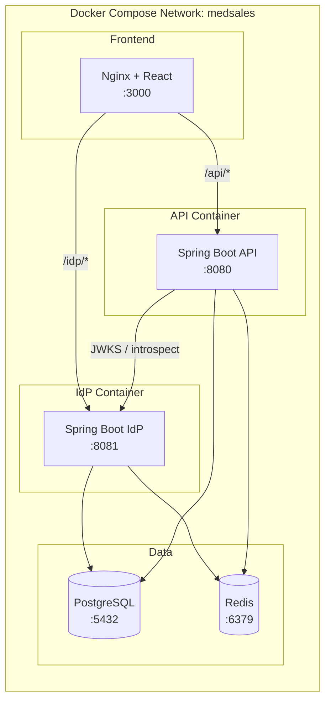
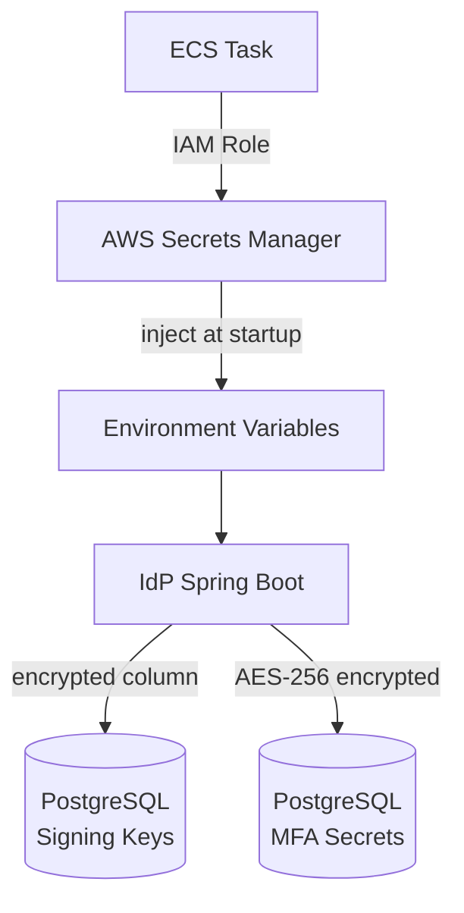
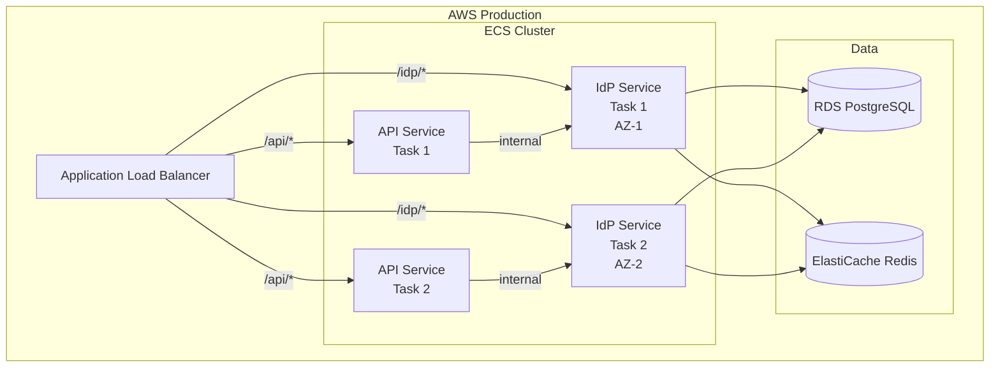

# Deployment Architecture
## MedSales Identity Provider

**Author:** Frank Reynolds, Solutions Architect & DevOps  
**Date:** February 28, 2026  
**Version:** 1.0

---

## 1. Overview

The IdP runs as a separate container alongside the main API in Docker Compose (dev) and as its own ECS service (staging/prod). Same network, same cluster, separate process.

---

## 2. Docker Compose — Development

```yaml
# Addition to existing docker-compose.yml
services:
  # ... existing api, worker, postgres, redis, web services ...

  idp:
    build:
      context: ./services/idp
      dockerfile: Dockerfile
    ports:
      - "8081:8081"
    environment:
      - SPRING_PROFILES_ACTIVE=dev
      - SERVER_PORT=8081
      - DB_HOST=postgres
      - DB_PORT=5432
      - DB_NAME=medsales
      - DB_USER=medsales_idp
      - DB_PASS=${IDP_DB_PASSWORD:-devpassword}
      - REDIS_HOST=redis
      - REDIS_PORT=6379
      - REDIS_KEY_PREFIX=idp:
      - IDP_ISSUER=http://localhost:8081
      - IDP_SIGNING_KEY_ID=dev-key-001
      - IDP_ACCESS_TOKEN_TTL=900
      - IDP_REFRESH_TOKEN_TTL=2592000
      - IDP_MFA_ISSUER=MedSales
      - ENCRYPTION_KEY=${IDP_ENCRYPTION_KEY:-dev-encryption-key-change-me}
    depends_on:
      postgres:
        condition: service_healthy
      redis:
        condition: service_healthy
    healthcheck:
      test: ["CMD", "wget", "-qO-", "http://localhost:8081/idp/health"]
      interval: 30s
      timeout: 5s
      retries: 3
    networks:
      - medsales

  # Update the api service to know about the IdP
  api:
    environment:
      - IDP_JWKS_URI=http://idp:8081/idp/.well-known/jwks.json
      - IDP_ISSUER=http://localhost:8081
      - IDP_INTROSPECT_URI=http://idp:8081/idp/oauth2/introspect
      - IDP_INTROSPECT_CLIENT_ID=medsales-api
      - IDP_INTROSPECT_CLIENT_SECRET=${API_IDP_SECRET:-dev-api-secret}
    depends_on:
      idp:
        condition: service_healthy
```

---

## 3. Container Architecture



### Port Mapping

| Service | Internal Port | External Port (Dev) | Path Prefix |
|---------|--------------|---------------------|-------------|
| IdP | 8081 | 8081 | `/idp/` |
| API | 8080 | 8080 | `/api/` |
| PostgreSQL | 5432 | 5432 | — |
| Redis | 6379 | 6379 | — |
| Web | 80 | 3000 | `/` |

---

## 4. Dockerfile — IdP Service

```dockerfile
# Build stage
FROM eclipse-temurin:21-jdk-alpine AS build
WORKDIR /app
COPY gradle/ gradle/
COPY gradlew build.gradle settings.gradle ./
RUN ./gradlew dependencies --no-daemon
COPY src/ src/
RUN ./gradlew bootJar --no-daemon -x test

# Runtime stage
FROM eclipse-temurin:21-jre-alpine
RUN addgroup -S idpgroup && adduser -S idpuser -G idpgroup
WORKDIR /app
COPY --from=build /app/build/libs/*.jar idp.jar

HEALTHCHECK --interval=30s --timeout=5s --retries=3 \
    CMD wget -qO- http://localhost:8081/idp/health || exit 1

USER idpuser
EXPOSE 8081

ENTRYPOINT ["java", \
    "-XX:+UseContainerSupport", \
    "-XX:MaxRAMPercentage=75.0", \
    "-Djava.security.egd=file:/dev/./urandom", \
    "-jar", "idp.jar"]
```

---

## 5. Secrets Management

### Development (Docker Compose)

Secrets via `.env` file (gitignored):

```bash
# .env
IDP_DB_PASSWORD=devpassword
IDP_ENCRYPTION_KEY=32-byte-hex-key-for-aes-256-dev
API_IDP_SECRET=dev-api-introspect-secret
```

### Production (AWS)

| Secret | Storage | Rotation |
|--------|---------|----------|
| Database password | AWS Secrets Manager | 90 days (automated) |
| AES-256 encryption key (MFA secrets) | AWS Secrets Manager | Manual (requires re-encryption) |
| RSA signing key (private) | Database (encrypted column) + Secrets Manager backup | 90 days |
| API introspection client secret | AWS Secrets Manager | 90 days |
| Redis auth token | AWS Secrets Manager | 90 days |



---

## 6. Production Deployment (ECS)



### ECS Task Definition (Key Settings)

| Setting | Value |
|---------|-------|
| CPU | 512 (0.5 vCPU) |
| Memory | 1024 MB |
| Min tasks | 2 (multi-AZ) |
| Max tasks | 6 (auto-scale) |
| Scale trigger | CPU > 60% or request count |
| Health check path | `/idp/health` |
| Health check interval | 30s |
| Deregistration delay | 60s |

### ALB Routing Rules

| Priority | Condition | Target Group |
|----------|-----------|--------------|
| 1 | Path = `/idp/*` | idp-target-group |
| 2 | Path = `/api/*` | api-target-group |
| 3 | Default | web-target-group |

---

## 7. Nginx Reverse Proxy (Dev/Staging)

For dev environments where we want a single entry point:

```nginx
upstream idp_backend {
    server idp:8081;
}

upstream api_backend {
    server api:8080;
}

server {
    listen 80;

    location /idp/ {
        proxy_pass http://idp_backend;
        proxy_set_header Host $host;
        proxy_set_header X-Real-IP $remote_addr;
        proxy_set_header X-Forwarded-For $proxy_add_x_forwarded_for;
        proxy_set_header X-Forwarded-Proto $scheme;
    }

    location /api/ {
        proxy_pass http://api_backend;
        proxy_set_header Host $host;
        proxy_set_header X-Real-IP $remote_addr;
        proxy_set_header X-Forwarded-For $proxy_add_x_forwarded_for;
        proxy_set_header X-Forwarded-Proto $scheme;
    }

    location / {
        root /usr/share/nginx/html;
        try_files $uri $uri/ /index.html;
    }
}
```

---

## 8. Monitoring

| Metric | Warning | Critical |
|--------|---------|----------|
| IdP response time (p95) | > 500ms | > 2s |
| IdP error rate (5xx) | > 0.5% | > 2% |
| Login failure rate | > 10% | > 25% |
| Token issuance rate | — | Drop > 50% from baseline |
| Active sessions | — | > 50,000 (capacity planning) |
| JWKS endpoint latency | > 100ms | > 500ms |

---

*Two containers. Same network. Same database cluster. The IdP talks to Postgres and Redis, the API talks to the IdP for keys and to Postgres for everything else. Clean separation, shared infrastructure. That's how you do microservices without turning your life into a distributed systems nightmare.*
