# Identity Provider (IdP) Architecture Overview
## MedSales Platform — Custom Identity Service

**Author:** Frank Reynolds, Solutions Architect & DevOps  
**Date:** February 28, 2026  
**Version:** 1.0

---

## 1. Executive Summary

This document describes the architecture for a custom Identity Provider (IdP) microservice for the MedSales platform. This service owns all authentication, authorization token issuance, MFA, and API key management — replacing the generic "Identity Provider" box in the existing system context diagram with a purpose-built service we control.

**Why build custom instead of using Keycloak/Auth0/Okta?**

- **Multi-tenant pharma compliance:** We need org-level isolation, audit trails, and the ability to enforce per-org auth policies (some orgs require MFA, some don't yet)
- **Cost at scale:** 10,000+ users across dozens of orgs. SaaS IdP pricing gets ugly fast
- **Control:** Token format, claims structure, session management — all tuned to our domain model
- **Integration depth:** The IdP shares the same PostgreSQL cluster and org/user model as the CRM. No syncing user databases between systems

---

## 2. What This Service Does

| Capability | Description |
|-----------|-------------|
| **User Authentication** | Email/password login with bcrypt hashing |
| **OAuth 2.0 Provider** | Authorization Code + PKCE for mobile, Client Credentials for API integrations |
| **JWT Token Issuance** | Access tokens (RS256, 15min TTL) + refresh tokens (opaque, 30-day TTL) |
| **MFA (TOTP)** | Time-based one-time passwords via authenticator apps |
| **API Key Management** | Long-lived keys for org-level API integrations |
| **Session Management** | Track active sessions, devices, revocation |
| **Audit Logging** | Every auth event logged — logins, failures, token refreshes, MFA challenges |
| **JWKS Endpoint** | Public key endpoint for token verification by other services |

---

## 3. System Context

```mermaid
graph TD
    subgraph Clients
        Mobile[📱 Mobile App<br>React Native]
        Web[💻 Web App<br>React SPA]
        ExtAPI[🔌 External API<br>Integrations]
    end

    subgraph "MedSales Platform"
        IDP[🔐 Identity Provider<br>Spring Boot<br>Port 8081]
        API[Spring Boot API<br>Port 8080]
        DB[(PostgreSQL<br>Shared Cluster)]
        Redis[(Redis<br>Session Cache)]
    end

    Mobile -->|1. Login / Token Request| IDP
    Web -->|1. Login / Token Request| IDP
    ExtAPI -->|1. Client Credentials| IDP
    IDP -->|2. Issue JWT| Mobile
    IDP -->|2. Issue JWT| Web
    IDP -->|2. Issue JWT| ExtAPI

    Mobile -->|3. API Request + JWT| API
    Web -->|3. API Request + JWT| API
    ExtAPI -->|3. API Request + JWT| API

    API -->|4. Fetch JWKS / Introspect| IDP
    IDP --> DB
    IDP --> Redis
    API --> DB
    API --> Redis
```

---

## 4. Tech Stack Recommendation

**Spring Boot 3.x + Java 21** — same as the main API.

See [ADR-IdP-001](adr/ADR-IdP-001-language.md) for the full decision record. Summary:

| Factor | Spring Boot | Node.js | Go |
|--------|------------|---------|-----|
| Team expertise | ✅ Already the stack | ❌ New skill | ❌ New skill |
| Crypto libraries | ✅ Bouncy Castle, mature | ⚠️ Adequate | ✅ Strong stdlib |
| Spring Security | ✅ Battle-tested OAuth2 server | N/A | N/A |
| Shared codebase patterns | ✅ Same conventions | ❌ Different everything | ❌ Different everything |
| Operational consistency | ✅ Same Docker base, same JVM tuning | ❌ New runtime | ❌ New runtime |
| Startup time | ⚠️ Slower (acceptable for IdP) | ✅ Fast | ✅ Fast |

**The deal:** We're already a Spring Boot shop. The main API is Spring Boot. The workers are Spring Boot. Charlie knows Spring Boot. I deploy Spring Boot. Adding a Node.js or Go service for one microservice means a whole new build pipeline, new Docker base image, new debugging tools, new monitoring config. It's not worth it. Not for this.

### Key Libraries

| Library | Purpose |
|---------|---------|
| Spring Authorization Server | OAuth 2.0 / OIDC provider framework |
| Spring Security | Authentication, password encoding |
| Bouncy Castle | RSA key generation, JWT signing |
| Nimbus JOSE+JWT | JWT creation and validation |
| dev.samstevens.totp | TOTP generation and verification |
| Flyway | Database migrations |
| Spring Data JPA | Database access |

---

## 5. Service Boundaries

The IdP is a **separate Spring Boot application** with its own:
- Dockerfile and container
- Port (8081)
- Health check endpoint (`/idp/health`)
- Database schema (tables in the shared PostgreSQL cluster, `idp_` prefix)
- API base path (`/idp/...`)

It shares:
- PostgreSQL cluster (same host, separate schema/tables)
- Redis cluster (separate key namespace `idp:`)
- Docker Compose network
- Git repository (monorepo — `services/idp/`)

---

## 6. API Surface

| Endpoint | Method | Purpose |
|----------|--------|---------|
| `/idp/oauth2/authorize` | GET | Authorization code request (PKCE) |
| `/idp/oauth2/token` | POST | Token exchange (all grant types) |
| `/idp/oauth2/revoke` | POST | Token revocation |
| `/idp/oauth2/introspect` | POST | Token introspection |
| `/idp/.well-known/jwks.json` | GET | Public signing keys |
| `/idp/.well-known/openid-configuration` | GET | OIDC discovery |
| `/idp/api/v1/users` | CRUD | User management (admin) |
| `/idp/api/v1/users/{id}/mfa` | POST/DELETE | MFA enrollment/removal |
| `/idp/api/v1/users/{id}/sessions` | GET/DELETE | Session management |
| `/idp/api/v1/api-keys` | CRUD | API key management |
| `/idp/api/v1/audit` | GET | Audit log queries (admin) |
| `/idp/health` | GET | Health check |

---

## 7. Non-Functional Requirements

| Requirement | Target |
|-------------|--------|
| **Availability** | 99.9% (IdP downtime = platform downtime) |
| **Login latency (p95)** | < 500ms |
| **Token issuance (p95)** | < 200ms |
| **JWKS fetch (p95)** | < 50ms (cached) |
| **Concurrent auth requests** | 1,000/sec peak |
| **Password hashing** | bcrypt, cost factor 12 |
| **Token signing** | RS256 with 2048-bit RSA keys, rotated every 90 days |
| **Refresh token storage** | Hashed (SHA-256), not plaintext |
| **Audit log retention** | 2 years minimum |
| **MFA enrollment** | Optional per-org, enforced at org policy level |

---

*Here's the deal — if the IdP goes down, nobody can log in, and if nobody can log in, the whole platform is a very expensive static page. This thing needs to be rock solid. No experiments. Proven tech. Ship it.*
