# System Architecture Overview
## Medical Sales Intelligence & CRM Platform

**Author:** Frank Reynolds, DevOps & Solutions Architect  
**Date:** February 28, 2026  
**Version:** 1.0

---

## 1. Executive Summary

This document describes the high-level system architecture for the Medical Sales Intelligence & CRM Platform — a mobile-first application that aggregates publicly available CMS healthcare data to build rich physician profiles, supports territory management and route planning, and provides CRM functionality for pharmaceutical and medical device sales reps.

The architecture is designed for:
- **~5 million physician records** with multi-source data joins
- **10,000+ concurrent users** (field reps, managers, admins)
- **Mobile-first** with offline capability
- **Multi-tenant SaaS** with organization-level data isolation
- **99.9% uptime** SLA

---

## 2. System Context

```mermaid
graph TD
    subgraph Users
        Rep[📱 Field Sales Rep<br>Mobile App]
        Mgr[💻 Territory Manager<br>Web App]
        Admin[🔧 Sales Ops / Admin<br>Web App]
    end

    subgraph Platform["Medical Sales Intelligence Platform"]
        API[Spring Boot API Gateway]
        Worker[Data Ingestion Workers]
    end

    subgraph "External Data Sources (Free)"
        CMS1[NPPES NPI Registry]
        CMS2[Provider Data Catalog]
        CMS3[Medicare Part B Utilization]
        CMS4[Medicare Part D Prescribers]
        CMS5[Open Payments]
        CMS6[Hospital Compare]
        CMS7[Facility Affiliation Data]
    end

    subgraph "External Services"
        GEO[Google Maps / Mapbox<br>Geocoding API]
        PUSH[Firebase Cloud Messaging<br>Push Notifications]
        AUTH[Identity Provider<br>SSO / SAML 2.0]
    end

    Rep -->|HTTPS| API
    Mgr -->|HTTPS| API
    Admin -->|HTTPS| API

    Worker -->|Download CSV| CMS1
    Worker -->|Download CSV| CMS2
    Worker -->|Download CSV| CMS3
    Worker -->|Download CSV| CMS4
    Worker -->|Download CSV| CMS5
    Worker -->|Download CSV| CMS6
    Worker -->|Download CSV| CMS7

    Worker -->|Geocode addresses| GEO
    API -->|Send notifications| PUSH
    API -->|Authenticate| AUTH
```

---

## 3. Architecture Principles

| # | Principle | Rationale |
|---|-----------|-----------|
| 1 | **API-first** | Single API layer serves mobile, web, and future integrations |
| 2 | **Data layer separation** | Public CMS data (read-heavy, shared) is separated from CRM data (read-write, tenant-isolated) |
| 3 | **Horizontal scalability** | Stateless API servers behind a load balancer; scale by adding instances |
| 4 | **Offline-first mobile** | Core physician profiles and CRM logging work without connectivity |
| 5 | **Multi-tenant by design** | Organization-level data isolation from day one, not bolted on later |
| 6 | **Automate everything** | Data ingestion, deployments, monitoring — no manual processes |
| 7 | **Free data, zero licensing cost** | Core data foundation is 100% public CMS data. No vendor lock-in on data |

---

## 4. High-Level Architecture

---

## 5. Component Summary

| Component | Technology | Purpose |
|-----------|-----------|---------|
| **Mobile App** | React Native (iOS + Android) | Field rep primary interface |
| **Web App** | React SPA | Manager dashboards, admin, reporting |
| **API Gateway** | Spring Boot 3.x | REST API, auth, business logic |
| **Physician Database** | PostgreSQL 16 + PostGIS 3.4 | Physician master data, geospatial queries |
| **CRM Database** | PostgreSQL 16 | Multi-tenant CRM data (calls, tasks, pipeline) |
| **Cache** | Redis 7.x Cluster | Session management, query caching, rate limiting |
| **Data Ingestion** | Spring Batch | CMS file download, parsing, loading, geocoding |
| **Job Queue** | Amazon SQS or RabbitMQ | Async job processing (notifications, exports, ingestion) |
| **Object Storage** | Amazon S3 | Raw CMS files, CSV exports, backups |
| **CDN** | CloudFront | Static assets, mobile app bundles |
| **Load Balancer** | AWS ALB | TLS termination, health checks, routing |
| **Push Notifications** | Firebase Cloud Messaging | Task reminders, manager alerts |
| **Monitoring** | Prometheus + Grafana | Metrics, dashboards |
| **Logging** | ELK Stack or CloudWatch | Centralized log aggregation |
| **Alerting** | PagerDuty / OpsGenie | Incident notification |

---

## 6. Key Architectural Decisions

Detailed Architecture Decision Records are maintained in the `/adr` directory:

- **[ADR-001](adr/ADR-001-database.md)** — PostgreSQL + PostGIS as primary database
- **[ADR-002](adr/ADR-002-search.md)** — Search strategy (PostGIS + pg_trgm for v1, Elasticsearch for v2)
- **[ADR-003](adr/ADR-003-mobile.md)** — React Native for cross-platform mobile

---

## 7. Data Flow Overview

### 7.1 Data Ingestion Flow

### 7.2 Physician Profile Request Flow

```mermaid
sequenceDiagram
    participant App as Mobile App
    participant ALB as Load Balancer
    participant API as Spring Boot API
    participant Cache as Redis Cache
    participant DB as PostgreSQL

    App->>ALB: GET /api/v1/physicians/{npi}
    ALB->>API: Forward request
    API->>Cache: Check cache (physician:{npi})
    alt Cache hit
        Cache-->>API: Cached profile
    else Cache miss
        API->>DB: Query physician + joins
        DB-->>API: Physician data
        API->>Cache: Store in cache (TTL 1hr)
    end
    API-->>ALB: 200 OK — Physician profile JSON
    ALB-->>App: Response
```

### 7.3 Nearby Physician Search Flow

---

## 8. Security Architecture

| Layer | Mechanism |
|-------|-----------|
| **Transport** | TLS 1.2+ everywhere |
| **Authentication** | OAuth 2.0 / SAML 2.0 with MFA |
| **Authorization** | RBAC: Rep (own data), Manager (team), Admin (org) |
| **Tenant Isolation** | `org_id` column on all CRM tables; enforced at query layer |
| **Data at Rest** | AES-256 encryption (RDS, S3) |
| **Audit** | All admin actions + data exports logged; 2-year retention |
| **API Security** | Rate limiting, input validation, JWT expiry |

---

## 9. Infrastructure & Deployment

See [Deployment Architecture](deployment-architecture.md) for full details.

**Target Cloud:** AWS (recommended) or GCP  
**Containerization:** Docker  
**Orchestration:** ECS Fargate or EKS  
**CI/CD:** GitHub Actions  
**IaC:** Terraform

---

## 10. Scalability Considerations

| Dimension | Approach |
|-----------|----------|
| **API throughput** | Horizontal scaling behind ALB; stateless instances |
| **Database reads** | PostgreSQL read replicas for physician data queries |
| **Database writes** | CRM writes go to primary; partitioned by org_id |
| **Caching** | Redis cluster for physician profiles, search results |
| **Data ingestion** | Parallel batch workers; partitioned file processing |
| **Storage** | S3 for raw files; PG for queryable data |
| **Search at scale** | PostGIS for v1; Elasticsearch for v2 if needed |

The system is designed to handle **10,000 concurrent users** and **10 million physician records** without architecture changes.

---

*Architecture is never done. This is v1. It works. We ship it, we watch it, we fix what breaks. That's the job.*
